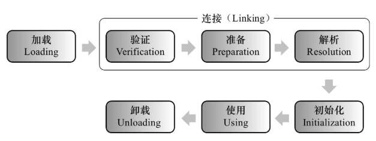
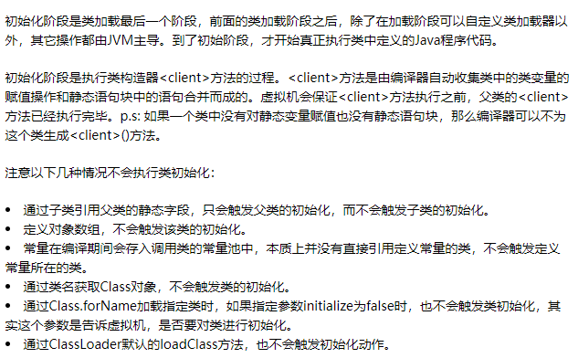
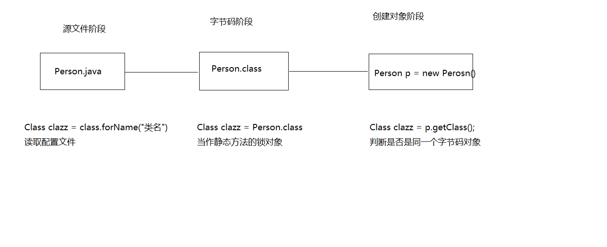

  

# javaEE框架师之路  

  

## 反射&JDK新特性   

     
  
    
## 01_反射(类的加载概述和加载时机)   
   

类的加载概述 ： 当程序要使用某个类时，如果该类还未被加载到内存中，则系统会通过加载，连接，初始化三步来实现对这个类进行初始化。   

* 加载 
	* 将class文件加载在内存中。
	* 将静态数据结构(数据存在于class文件的结构)转化成方法区中运行时的数据结构(数据存在于JVM时的数据结构)。
	* 在堆中生成一个代表这个类的java.lang.Class对象，作为数据访问的入口。
* 连接
	* 验证
		* 这一阶段的主要目的是为了确保Class文件的字节流中包含的信息是否符合当前虚拟机的要求，并且不会危害虚拟机自身的安全。
	* 准备 
		* 为static变量在方法区中分配空间，设置变量的初始值。例如static int a=3，在此阶段会a被初始化为0，其他数据类型参考成员变量声明。
	* 解析 虚拟机将常量池的符号引用转变成直接引用。例如"aaa"为常量池的一个值，直接把"aaa"替换成存在于内存中的地址。   
		* 符号引用:符号引用以一组符号来描述所引用的目标，符号可以是任何形式的字面量，只要使用时能无歧义地定位到目标即可。符号引用与虚拟机实现的内存布局无关，引用 的目标并不一定已经加载到内存中。
		* 直接引用:直接引用可以是直接指向目标的指针、相对偏移量或是一个能间接定位到目标的句柄。直接引用是与虚拟机实现的内存布局相关的，如果有了直接引用，那么引用的目标必定已经在内存中存在。
		
	* 初始化   
		   

* B:加载时机
	* 创建类的实例
	* 访问类的静态变量，或者为静态变量赋值
	* 调用类的静态方法
	* 使用反射方式来强制创建某个类或接口对应的java.lang.Class对象
	* 初始化某个类的子类
	* 直接使用java.exe命令来运行某个主类    
   

### 02_反射(类加载器的概述和分类)
* A:类加载器的概述
	* 负责将.class文件加载到内存中，并为之生成对应的Class对象。虽然我们不需要关心类加载机制，但是了解这个机制我们就能更好的理解程序的运行。
* B:类加载器的分类
	* Bootstrap ClassLoader 根类加载器
	* Extension ClassLoader 扩展类加载器
	* Sysetm ClassLoader 系统类加载器
* C:类加载器的作用
	* Bootstrap ClassLoader 根类加载器
		* 也被称为引导类加载器，负责Java核心类的加载
		* 比如System,String等。在JDK中JRE的lib目录下rt.jar文件中
	* Extension ClassLoader 扩展类加载器
		* 负责JRE的扩展目录中jar包的加载。
		* 在JDK中JRE的lib目录下ext目录
	* Sysetm ClassLoader 系统类加载器
		* 负责在JVM启动时加载来自java命令的class文件，以及classpath环境变量所指定的jar包和类路径

### 03_反射(反射概述)
* A:反射概述
	* JAVA反射机制是在运行状态中，对于任意一个类，都能够知道这个类的所有属性和方法；
	* 对于任意一个对象，都能够调用它的任意一个方法和属性；
	* 这种动态获取的信息以及动态调用对象的方法的功能称为java语言的反射机制。
	* 要想解剖一个类,必须先要获取到该类的字节码文件对象。
	* 而解剖使用的就是Class类中的方法，所以先要获取到每一个字节码文件对应的Class类型的对象。

* B:三种方式
	* a:Object类的getClass()方法,判断两个对象是否是同一个字节码文件
	* b:静态属性class,锁对象
	* c:Class类中静态方法forName(),读取配置文件
* C:案例演示
	* 获取class文件对象的三种方式   
  
    
   
### 04_反射(Class.forName()读取配置文件举例)
* 榨汁机(Juicer)榨汁的案例
* 分别有水果(Fruit)苹果(Apple)香蕉(Banana)桔子(Orange)榨汁(squeeze)

		public class Demo2_Reflect {

			/**
			 * 榨汁机(Juicer)榨汁的案例
			 * 分别有水果(Fruit)苹果(Apple)香蕉(Banana)桔子(Orange)榨汁(squeeze)
			 * @throws Exception 
			 */
			public static void main(String[] args) throws Exception {
				/*Juicer j = new Juicer();
				//j.run(new Apple());
				j.run(new Orange());*/

				BufferedReader br = new BufferedReader(new FileReader("config.properties"));	//创建输入流对象,关联配置文件
				Class<?> clazz = Class.forName(br.readLine());									//读取配置文件一行内容,获取该类的字节码对象
				Fruit f = (Fruit) clazz.newInstance();											//通过字节码对象创建实例对象
				Juicer j = new Juicer();
				j.run(f);
			}
		
		}
		interface Fruit {
			public void squeeze();
		}
		
		class Apple implements Fruit {
			public void squeeze() {
				System.out.println("榨出一杯苹果汁儿");
			}
		}
		
		class Orange implements Fruit {
			public void squeeze() {
				System.out.println("榨出一杯桔子汁儿");
			}
		}
		
		class Juicer {
			public void run(Fruit f) {
				f.squeeze();
			}
		
		}   
   
  
### 05_反射(通过反射获取带参构造方法并使用)
Constructor   

* Class类的newInstance()方法是使用该类无参的构造函数创建对象, 如果一个类没有无参的构造函数, 就不能这样创建了,可以调用Class类的getConstructor(String.class,int.class)方法获取一个指定的构造函数然后再调用Constructor类的newInstance("张三",20)方法创建对象   

		public static void main(String[] args) throws Exception {
			Class clazz = Class.forName("com.heima.bean.Person");
			//Person p = (Person) clazz.newInstance();				通过无餐构造创建对象
			//System.out.println(p);
			Constructor c = clazz.getConstructor(String.class,int.class);	//获取有参构造
			Person p = (Person) c.newInstance("张三",23);						//通过有参构造创建对象
			System.out.println(p);
		}   
   
   
### 06_反射(通过反射获取成员变量并使用)
Field    

* Class.getField(String)方法可以获取类中的指定字段(可见的), 如果是私有的可以用getDeclaedField("name")方法获取,通过set(obj, "李四")方法可以设置指定对象上该字段的值, 如果是私有的需要先调用setAccessible(true)设置访问权限,用获取的指定的字段调用get(obj)可以获取指定对象中该字段的值    

		public static void main(String[] args) throws Exception {
			Class clazz = Class.forName("com.heima.bean.Person");
			Constructor c = clazz.getConstructor(String.class,int.class);	//获取有参构造
			Person p = (Person) c.newInstance("张三",23);						//通过有参构造创建对象
			
			//Field f = clazz.getField("name");								//获取姓名字段
			//f.set(p, "李四");												//修改姓名的值
			Field f = clazz.getDeclaredField("name");						//暴力反射获取字段
			f.setAccessible(true);											//去除私有权限
			f.set(p, "李四");	
			
			System.out.println(p);
		}   
    
  
### 07_反射(通过反射获取方法并使用)
Method    

* Class.getMethod(String, Class...) 和 Class.getDeclaredMethod(String, Class...)方法可以获取类中的指定方法,调用invoke(Object, Object...)可以调用该方法,Class.getMethod("eat") invoke(obj) Class.getMethod("eat",int.class) invoke(obj,10)   

    
		public static void main(String[] args) throws Exception {
			Class clazz = Class.forName("com.heima.bean.Person");
			Constructor c = clazz.getConstructor(String.class,int.class);	//获取有参构造
			Person p = (Person) c.newInstance("张三",23);						//通过有参构造创建对象
			
			Method m = clazz.getMethod("eat");								//获取eat方法
			m.invoke(p);
			
			Method m2 = clazz.getMethod("eat", int.class);					//获取有参的eat方法
			m2.invoke(p, 10);
		}    
    
   
   
### 17_JDK7新特性(JDK7的六个新特性回顾和讲解)
* A:二进制字面量
* B:数字字面量可以出现下划线
* C:switch 语句可以用字符串
* D:泛型简化,菱形泛型
* E:异常的多个catch合并,每个异常用或|
* F:try-with-resources 语句（自动关流）      
   
  
      
		在Java SE 7之前，声明泛型对象的代码如下:
		List<String> list = new ArrayList<String>();    
		而在Java 7中，可以使用如下代码：
		List<String> list = new ArrayList<>();

  
		---------------------------------------------------------------------------------------------------------
		public static void main(String[] args) {
			System.out.println(0b110);
			System.out.println(100_000);
		}

		传统的资源关闭方式
		为了确保外部资源一定要被关闭，通常关闭代码被写入finally代码块中，当然我们还必须注意到关闭资源时可能抛出的异常，于是变有了下面的经典代码：
		public static void main(String[] args) {
		    FileInputStream inputStream = null;
		    try {
		        inputStream = new FileInputStream(new File("test"));
		        System.out.println(inputStream.read());
		    } catch (IOException e) {
		        throw new RuntimeException(e.getMessage(), e);
		    } finally {
		        if (inputStream != null) {
		            try {
		                inputStream.close();
		            } catch (IOException e) {
		                throw new RuntimeException(e.getMessage(), e);
		            }
		        }
		    }
		}   
    
		那什么是try-with-resource呢？简而言之，当一个外部资源的句柄对象（比如FileInputStream对象）
		实现了AutoCloseable接口，那么就可以将上面的板式代码简化为如下形式：   
   
		public static void main(String[] args) {
		    try (FileInputStream inputStream = new FileInputStream(new File("test"))) {
		        System.out.println(inputStream.read());
		    } catch (IOException e) {
		        throw new RuntimeException(e.getMessage(), e);
		    }
		}   
    
   
### 18_JDK8新特性(JDK8的新特性)
* 接口中可以定义有方法体的方法,如果是非静态,必须用default修饰	
* 如果是静态的就不用了

		class Demo1 {
			public static void main(String[] args) {
				/*Demo d = new Demo();
				d.print();
		
				Inter.method();*/
		
				Demo d = new Demo();
				d.run();
			}
		}
		
		interface Inter {
			public default void print() {
				System.out.println("Hello World");
			}
		
			public static void method() {
				System.out.println("static method");
			}
		}
		
		class Demo implements Inter {
			public void run() {
				int num = 10;							//JDK8,前面的final可以省略
				class Inner {
					public void fun() {
						System.out.println(num);
					}
				}
		
				Inner i = new Inner();
				i.fun();
			}
		}

		局部内部类在访问他所在方法中的局部变量必须用final修饰,为什么?
		因为当调用这个方法时,局部变量如果没有用final修饰,他的生命周期和方法的生命周期是一样的,当方法弹栈,这个局部变量也会消失,
		那么如果局部内部类对象还没有马上消失想用这个局部变量,就没有了,如果用final修饰会在类加载的时候进入常量池,
		即使方法弹栈,常量池的常量还在,也可以继续使用    
    
