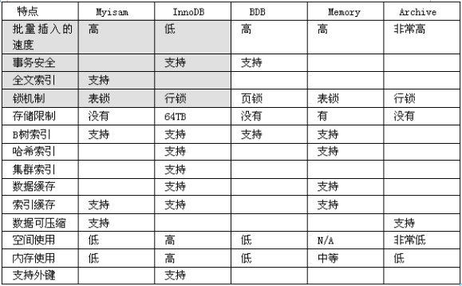

  

# MySQL04优化  

  

    
    
## 对mysql优化时一个综合性的技术，主要包括    

* 表的设计合理化 ( 符合3NF )
* 添加适当索引 (index) **常见索引（四种）：** 
	* 普通索引、主键索引、唯一索引unique、全文索引、（空间索引）
* 分表技术：(水平分割、垂直分割)
* 读写分离
	* **[写: update/delete/add]**
* 存储过程
	* [模块化编程，可以提高速度]
* 对mysql配置优化
	* [配置最大并发数my.ini, 调整缓存大小 ]
* mysql服务器硬件升级
* 定时的去清除不需要的数据,定时进行碎片整理(MyISAM) 

   
## 数据库表的设计  

第一范式：1NF是对属性的原子性约束，要求属性(列)具有原子性，不可再分解；(只要是关系型数据库都满足1NF)    
第二范式：2NF是对记录的惟一性约束，要求记录有惟一标识，即实体的惟一性；     
第三范式：3NF是对字段冗余性的约束，它要求字段没有冗余。 没有冗余的数据库设计可以做到。    
但是，没有冗余的数据库未必是最好的数据库，有时为了提高运行效率，就必须降低范式标准，适当保留冗余数据。具体做法是： 在概念数据模型设计时遵守第三范式，降低范式标准的工作放到物理数据模型设计时考虑。降低范式就是增加字段，允许冗余。     
    

关系型数据库: mysql/oracle/db2/informix/sysbase/sql server   
非关系型数据库: (特点: 面向对象或者集合)   
NoSql数据库: MongoDB(特点是面向文档)   
   
### Sql语句本身的优化

问题是： 如何从一个大项目中，迅速的定位执行速度慢的语句. (定位慢查询)   
   
①首先我们了解mysql数据库的一些运行状态如何查询(比如想知道当前mysql运行的时间/一共执行了多少次select/update/delete.. / 当前连接)   
  
show status

常用的:
show status like ‘uptime’ ;     
show  stauts like ‘com_select’  show stauts like ‘com_insert’ ...类推 update  delete   

☞ show [session|global] status like .... 如果你不写  [session|global] 默认是session 会话，指取出当前窗口的执行，如果你想看所有(从mysql 启动到现在，则应该 global)   

show status like ‘connections’;    
//显示慢查询次数   
show status like ‘slow_queries’;   
   
  
②如何去定位慢查询   
   
默认情况下，mysql认为10秒才是一个慢查询.  
   
修改mysql的慢查询.

	show variables like ‘long_query_time’ ; //可以显示当前慢查询时间    
	set long_query_time=1 ;//可以修改慢查询时间    
   
构建大表->大表中记录有要求, 记录是不同才有用，否则测试效果和真实的相差大.     
      

	#创建:  
	CREATE TABLE dept( /*部门表*/
	deptno MEDIUMINT   UNSIGNED  NOT NULL  DEFAULT 0,  /*编号*/
	dname VARCHAR(20)  NOT NULL  DEFAULT "", /*名称*/
	loc VARCHAR(13) NOT NULL DEFAULT "" /*地点*/
	) ENGINE=MyISAM DEFAULT CHARSET=utf8 ;    
   
	#创建表EMP雇员
	CREATE TABLE emp(
	empno  MEDIUMINT UNSIGNED  NOT NULL  DEFAULT 0, /*编号*/
	ename VARCHAR(20) NOT NULL DEFAULT "", /*名字*/
	job VARCHAR(9) NOT NULL DEFAULT "",/*工作*/
	mgr MEDIUMINT UNSIGNED NOT NULL DEFAULT 0,/*上级编号*/
	hiredate DATE NOT NULL,/*入职时间*/
	sal DECIMAL(7,2)  NOT NULL,/*薪水*/
	comm DECIMAL(7,2) NOT NULL,/*红利*/
	deptno MEDIUMINT UNSIGNED NOT NULL DEFAULT 0 /*部门编号*/
	)ENGINE=MyISAM DEFAULT CHARSET=utf8 ;    
   
	#工资级别表
	CREATE TABLE salgrade
	(
	grade MEDIUMINT UNSIGNED NOT NULL DEFAULT 0,
	losal DECIMAL(17,2)  NOT NULL,
	hisal DECIMAL(17,2)  NOT NULL
	)ENGINE=MyISAM DEFAULT CHARSET=utf8;
	
	INSERT INTO salgrade VALUES (1,700,1200);
	INSERT INTO salgrade VALUES (2,1201,1400);
	INSERT INTO salgrade VALUES (3,1401,2000);
	INSERT INTO salgrade VALUES (4,2001,3000);
	INSERT INTO salgrade VALUES (5,3001,9999);    
     

   
	#定义一个新的命令结束符合
	delimiter $$
	#删除自定的函数
	drop  function rand_string $$    
   
  
④如果把慢查询的sql记录到我们的一个日志中    
在默认情况下，我们的mysql不会记录慢查询，需要在启动mysql时候，指定记录慢查询才可以   
bin\mysqld.exe --safe-mode  --slow-query-log [mysql5.5 可以在my.ini指定]   
bin\mysqld.exe –log-slow-queries=d:/abc.log [低版本mysql5.0可以在my.ini指定]   
   
	先关闭mysql,再启动, 如果启用了慢查询日志，默认把这个文件放在   
	my.ini 文件中记录的位置   
	#Path to the database root  
	datadir="C:/Documents and Settings/All Users/Application Data/MySQL/MySQL Server 5.5/Data/"   

⑤测试,可以看到在日志中就记录下我们的mysql慢sql语句.    
   
优化问题.    
通过 explain 语句可以分析，mysql如何执行你的sql语句, 这个工具的使用放一下，一会说.    
      
  
   
## 四种索引(主键索引/唯一索引/全文索引/普通索引)   
   
1.1主键索引添加   
当一张表，把某个列设为主键的时候，则该列就是主键索引   

	create table aaa   
	(id int unsigned primary key auto_increment ,
	name varchar(32) not null defaul ‘’);   

这是id 列就是主键索引.

如果你创建表时，没有指定主键索引，也可以在创建表后，在添加, 指令:

	alter table 表名 add primary key (列名);

举例:    

	create table bbb (id int , name varchar(32) not null default ‘’);
	
	alter table bbb add primary key (id);    
    
      
1.2普通索引   
一般来说，普通索引的创建，是先创建表，然后在创建普通索引   
比如:  

	create table ccc(
	id int unsigned,
	name varchar(32)
	)

	create index 索引名 on 表 (列1,列名2);
   

1.3创建全文索引

全文索引，主要是针对对文件，文本的检索, 比如文章, 全文索引针对MyISAM有用.

创建 ：    

	CREATE TABLE articles (
	       id INT UNSIGNED AUTO_INCREMENT NOT NULL PRIMARY KEY,
	       title VARCHAR(200),
	       body TEXT,
	       FULLTEXT (title,body)
	     )engine=myisam charset utf8;

	INSERT INTO articles (title,body) VALUES
	     ('MySQL Tutorial','DBMS stands for DataBase ...'),
	     ('How To Use MySQL Well','After you went through a ...'),
	     ('Optimizing MySQL','In this tutorial we will show ...'),
	     ('1001 MySQL Tricks','1. Never run mysqld as root. 2. ...'),
	     ('MySQL vs. YourSQL','In the following database comparison ...'),
	     ('MySQL Security','When configured properly, MySQL ...');   
   
    
如何使用全文索引:  
错误用法:   

	select * from articles where body like ‘%mysql%’; 【不会使用到全文索引】   

证明:   

	explain  select * from articles where body like ‘%mysql%’

正确的用法是:   

	select * from articles where match(title,body) against(‘database’); 【可以】     
      
  
说明:   

* 1.在mysql中fulltext 索引只针对 myisam生效  
* 2.mysql自己提供的fulltext针对英文生效->sphinx (coreseek) 技术处理中文   
* 3.使用方法是 match(字段名..) against(‘关键字’)   
* 4.全文索引一个 叫 停止词,  因为在一个文本中，创建索引是一个无穷大的数，因此，对一些常用词和字符，就不会创建，这些词，称为停止词.   
     

1.4唯一索引   

①当表的某列被指定为unique约束时，这列就是一个唯一索引   

	create table ddd(id int primary key auto_increment , name varchar(32) unique);

这时, name 列就是一个唯一索引.  

unique字段可以为NULL,并可以有多NULL, 但是如果是具体内容，则不能重复.   

主键字段，不能为NULL,也不能重复.     
   
②在创建表后，再去创建唯一索引   
	
	create table eee(id int primary key auto_increment, name varchar(32));
	
	create unique index 索引名  on 表名 (列表..);

  
2.查询索引

desc 表名 【该方法的缺点是：　不能够显示索引名.】    
show index(es) from 表名   
show keys from 表名      
   
     
   

3.删除

	alter table 表名 drop index 索引名;  

如果删除主键索引。   
	alter table 表名 drop primary key       [这里有一个小问题]  
  
  

4.修改

先删除，再重新创建.    
  
  
    
---  

    
   
---   
   
### 索引的代价:   
1.占用磁盘空间   
2.对dml操作有影响，变慢   
   
    
  
    
  
总结: 满足以下条件的字段，才应该创建索引.    
a: 肯定在where条件中经常使用    
b: 该字段的内容不是唯一的几个值(sex)    
c: 字段内容不是频繁变化     
   
  
## 使用索引的注意事项   
   
	alter table dept add index my_ind (dname,loc); //  dname 左边的列,loc就是右边的列

说明，如果我们的表中有复合索引(索引作用在多列上)， 此时我们注意:   
1 . 对于创建的多列索引，只要查询条件使用了最左边的列，索引一般就会被使用。

	explain select * from dept where loc='aaa'\G 
	就不会使用到索引   
  
      
   
2 . 对于使用like的查询，查询如果是  ‘%aaa’ 不会使用到索引   
	‘aaa%’ 会使用到索引。

	比如: explain select * from dept where dname like '%aaa'\G   
	不能使用索引
	即在like查询时，关键字最前面，不能使用 % 或者 _ 这样的字符. 
	如果一定要前面有变化的值，则考虑使用 全文索引-> sphinx.  
  
3 . 如果条件中有or，即使其中有条件带索引也不会使用。  
换言之，就是要求使用的所有字段，都必须建立索引, 我们建议大家尽量避免使用or 关键字

	select * from dept where dname=’xxx’ or loc=’xx’ or deptno=45   
   
4 . 如果列类型是字符串，那一定要在条件中将数据使用引号引用起来。否则不使用索引。  
  
	(添加时,字符串必须’’), 也就是，如果列是字符串类型，就一定要用 ‘’ 把他包括起来.    
   
5 . 如果mysql估计使用全表扫描要比使用索引快，则不使用索引。   
  
  
## sql语句的小技巧

1 . 在使用group by 分组查询是，默认分组后，还会排序，可能会降低速度.   
   
   
在group by 后面增加 order by null 就可以防止排序.      
  
2 . 有些情况下，可以使用连接来替代子查询。因为使用join，MySQL不需要在内存中创建临时表。

	select * from dept, emp where dept.deptno=emp.deptno; [简单处理方式]
	
	select * from dept left join emp on dept.deptno=emp.deptno;  [左外连接，更ok!]   
   
  
## 如何选择mysql的存储引擎   
   
* myisam 存储：如果表对事务要求不高，同时是以查询和添加为主的，我们考虑使用myisam存储引擎. ,比如 bbs 中的 发帖表，回复表.
* InnoDB 存储：对事务要求高，保存的数据都是重要数据，我们建议使用InnoDB,比如订单表，账号表.
* Memory 存储：比如我们数据变化频繁，不需要入库，同时又频繁的查询和修改，我们考虑使用memory, 速度极快.   

### 问 Myisam 和 InnoDB的区别    

   