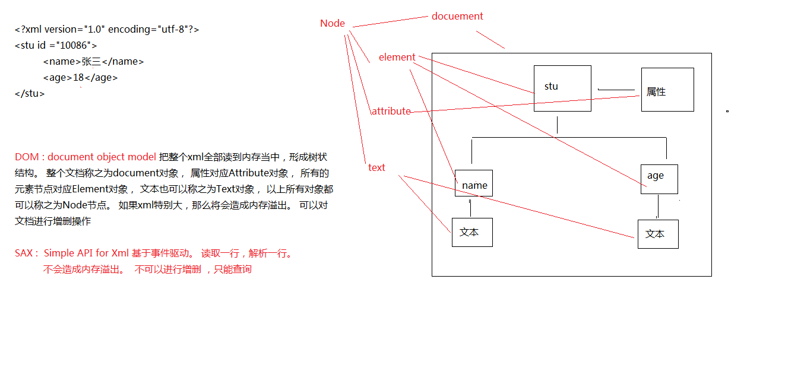

  

# javaEE框架师之路  

  

## 四、JavaWeb基础01   

    
     
### XML  
   
>eXtendsible  markup language  可扩展的标记语言  

#### XML 有什么用?

1. 可以用来保存数据
2. 可以用来做配置文件
3. 数据传输载体  

#### 文档声明

		简单声明， version : 解析这个xml的时候，使用什么版本的解析器解析
		<?xml version="1.0" ?>
	
		encoding : 解析xml中的文字的时候，使用什么编码来翻译
		<?xml version="1.0" encoding="gbk" ?>
	
		standalone  : no - 该文档会依赖关联其他文档 ，  yes-- 这是一个独立的文档
		<?xml version="1.0" encoding="gbk" standalone="no" ?>
  
#### encoding详解

> 在解析这个xml的时候，使用什么编码去解析。   ---解码。 

	 文字， 而是存储这些文字对应的二进制 。 那么这些文字对应的二进制到底是多少呢？ 根据文件使用的编码 来得到。 

> 默认文件保存的时候，使用的是GBK的编码保存。 

所以要想让我们的xml能够正常的显示中文，有两种解决办法

1. 让encoding也是GBK 或者 gb2312 . 
2. 如果encoding是 utf-8 ， 那么保存文件的时候也必须使用utf-8
3. 保存的时候见到的ANSI 对应的其实是我们的本地编码 GBK。

为了通用，建议使用UTF-8编码保存，以及encoding 都是 utf-8   
   
### CDATA区

* 非法字符

  严格地讲，在 XML 中仅有字符 "<"和"&" 是非法的。省略号、引号和大于号是合法的，但是把它们替换为实体引用是个好的习惯。 

	  <   &lt;
	  &   &amp;   
   
	<des><![CDATA[<a href="http://www.baidu.com">我爱黑马训练营</a>]]></des>    
   
### XML解析方式(面试常问)

> 有很多种，但是常用的有两种。

* DOM

* SAX

    
   
### Dom4j 基本用法

		element.element("stu") : 返回该元素下的第一个stu元素
		element.elements(); 返回该元素下的所有子元素。 

1. 创建SaxReader对象

2. 指定解析的xml

3. 获取根元素。

4. 根据根元素获取子元素或者下面的子孙元素

		try {
			//1. 创建sax读取对象
			SAXReader reader = new SAXReader(); //jdbc -- classloader
			//2. 指定解析的xml源
			Document  document  = reader.read(new File("src/xml/stus.xml"));
			
			//3. 得到元素、
			//得到根元素
			Element rootElement= document.getRootElement();
			
			//获取根元素下面的子元素 age
		//rootElement.element("age") 
			//System.out.println(rootElement.element("stu").element("age").getText());

			//获取根元素下面的所有子元素 。 stu元素
			List<Element> elements = rootElement.elements();
			//遍历所有的stu元素
			for (Element element : elements) {
				//获取stu元素下面的name元素
				String name = element.element("name").getText();
				String age = element.element("age").getText();
				String address = element.element("address").getText();
				System.out.println("name="+name+"==age+"+age+"==address="+address);
			}
			
		} catch (Exception e) {
			e.printStackTrace();
		}   
   
