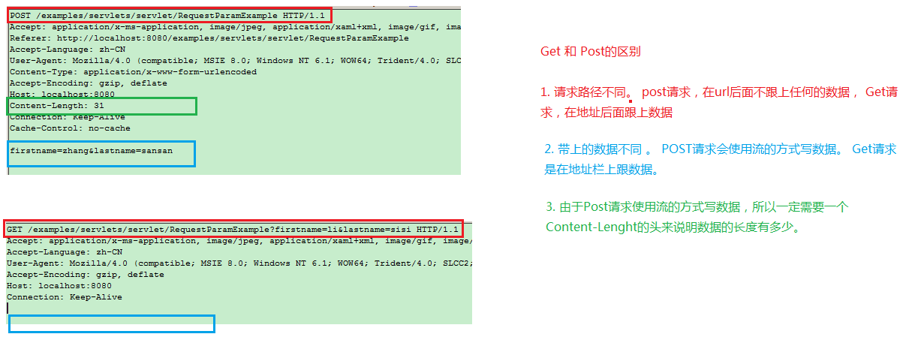

  

# javaEE框架师之路  

  

## 四、JavaWeb基础02   

    
     
### HTTP协议  
  
* 版本
	
		1.0 ： 请求数据，服务器返回后， 将会断开连接
		
		1.1 ： 请求数据，服务器返回后， 连接还会保持着。 除非服务器 | 客户端 关掉。有一定的时间限制，如果都空着这个连接，那么后面会自己断掉。   
   
### Http请求数据解释 

> 请求的数据里面包含三个部分内容 ： 请求行 、 请求头 、请求体

* 请求行

		POST /examples/servlets/servlet/RequestParamExample HTTP/1.1 

		POST ： 请求方式 ，以post去提交数据
			
		/examples/servlets/servlet/RequestParamExample
		请求的地址路径 ， 就是要访问哪个地方。
	
		HTTP/1.1 协议版本

* 请求头

		Accept: application/x-ms-application, image/jpeg, application/xaml+xml, image/gif, image/pjpeg, application/x-ms-xbap, */*
		Referer: http://localhost:8080/examples/servlets/servlet/RequestParamExample
		Accept-Language: zh-CN
		User-Agent: Mozilla/4.0 (compatible; MSIE 8.0; Windows NT 6.1; WOW64; Trident/4.0; SLCC2; .NET CLR 2.0.50727; .NET CLR 3.5.30729; .NET CLR 3.0.30729; Media Center PC 6.0; .NET4.0C; .NET4.0E)
		Content-Type: application/x-www-form-urlencoded
		Accept-Encoding: gzip, deflate
		Host: localhost:8080
		Content-Length: 31
		Connection: Keep-Alive
		Cache-Control: no-cache

		Accept: 客户端向服务器端表示，我能支持什么类型的数据。 
		Referer ： 真正请求的地址路径，全路径
		Accept-Language: 支持语言格式
		User-Agent: 用户代理 向服务器表明，当前来访的客户端信息。 
		Content-Type： 提交的数据类型。经过urlencoding编码的form表单的数据
		Accept-Encoding： gzip, deflate ： 压缩算法 。 
		Host ： 主机地址
		Content-Length： 数据长度
		Connection : Keep-Alive 保持连接
		Cache-Control ： 对缓存的操作

* 请求体  

>浏览器真正发送给服务器的数据 
	
		发送的数据呈现的是key=value ,如果存在多个数据，那么使用 &

		firstname=zhang&lastname=sansan    
    
### Http响应数据解析

> 请求的数据里面包含三个部分内容 ： 响应行 、 响应头 、响应体

	HTTP/1.1 200 OK
	Server: Apache-Coyote/1.1
	Content-Type: text/html;charset=ISO-8859-1
	Content-Length: 673
	Date: Fri, 17 Feb 2017 02:53:02 GMT

	...这里还有很多数据...

* 响应行
	
		HTTP/1.1 200 OK

		协议版本  

		状态码 

			咱们这次交互到底是什么样结果的一个code. 
		
			200 : 成功，正常处理，得到数据。
	
			403  : for bidden  拒绝
			404 ： Not Found
			500 ： 服务器异常

		OK

			对应前面的状态码  

* 响应头

		Server:  服务器是哪一种类型。  Tomcat
	
		Content-Type ： 服务器返回给客户端你的内容类型

		Content-Length ： 返回的数据长度

		Date ： 通讯的日期，响应的时间		
   
### Get 和  Post请求区别

* post

		1. 数据是以流的方式写过去，不会在地址栏上面显示。  现在一般提交数据到服务器使用的都是POST
	
		2. 以流的方式写数据，所以数据没有大小限制。

* get

		1. 会在地址栏后面拼接数据，所以有安全隐患。 一般从服务器获取数据，并且客户端也不用提交上面数据的时候，可以使用GET
	
		2. 能够带的数据有限， 1kb大小

### Servlet是什么?

> 其实就是一个java程序，运行在我们的web服务器上，用于接收和响应 客户端的http请求。 

> 更多的是配合动态资源来做。 当然静态资源也需要使用到servlet，只不过是Tomcat里面已经定义好了一个 DefaultServlet   

### Hello Servlet

1. 得写一个Web工程 ， 要有一个服务器。

2. 测试运行Web工程

		1. 新建一个类， 实现Servlet接口
	
		2. 配置Servlet ， 用意： 告诉服务器，我们的应用有这么些个servlet。

			在webContent/WEB-INF/web.xml里面写上以下内容。

		  <!-- 向tomcat报告， 我这个应用里面有这个servlet， 名字叫做HelloServlet , 具体的路径是com.itheima.servlet.HelloServlet -->
		  <servlet>
		  	<servlet-name>HelloServlet</servlet-name>
		  	<servlet-class>com.itheima.servlet.HelloServlet</servlet-class>
		  </servlet>
		  
		  <!-- 注册servlet的映射。  servletName : 找到上面注册的具体servlet，  url-pattern: 在地址栏上的path 一定要以/打头 -->
		  <servlet-mapping>
		  	<servlet-name>HelloServlet</servlet-name>
		  	<url-pattern>/a</url-pattern>
		  </servlet-mapping>

		3. 在地址栏上输入 http://localhost:8080/项目名称/a   

  
### Servlet的生命周期

* 生命周期方法

> 从创建到销毁，所调用的那些方法。

* init方法

		在创建该servlet的实例时，就执行该方法。
		一个servlet只会初始化一次， init方法只会执行一次
		默认情况下是 ： 初次访问该servlet，才会创建实例。 

* service方法

		只要客户端来了一个请求，那么就执行这个方法了。
	 	该方法可以被执行很多次。 一次请求，对应一次service方法的调用

* destroy方法

		
		servlet销毁的时候，就会执行该方法
		
		  	1. 该项目从tomcat的里面移除。
		  	2. 正常关闭tomcat就会执行 shutdown.bat
		 

> doGet 和 doPost不算生命周期方法，所谓的生命周期方法是指，从对象的创建到销毁一定会执行的方法， 但是这两个方法，不一定会执行。   

在配置的时候， 使用load-on-startup元素来指定， 给定的数字越小，启动的时机就越早。 一般不写负数， 从2开始即可。 

	<servlet>
		<servlet-name>HelloServlet04</servlet-name>
		<servlet-class>com.itheima.servlet.HelloServlet04</servlet-class>
		<load-on-startup>2</load-on-startup>
	</servlet>    
   
### ServletConfig

>Servlet的配置，通过这个对象，可以获取servlet在配置的时候一些信息

		//1. 得到servlet配置对象 专门用于在配置servlet的信息
		ServletConfig config = getServletConfig();
		
		//获取到的是配置servlet里面servlet-name 的文本内容
		String servletName = config.getServletName();
		System.out.println("servletName="+servletName);
		
		
		//2、。 可以获取具体的某一个参数。 
		String address = config.getInitParameter("address");
		System.out.println("address="+address);

		//3.获取所有的参数名称
		Enumeration<String> names = config.getInitParameterNames();
		//遍历取出所有的参数名称
		while (names.hasMoreElements()) {
			String key = (String) names.nextElement();
			String value = config.getInitParameter(key);
			System.out.println("key==="+key + "   value="+value);
			
		}   
   
