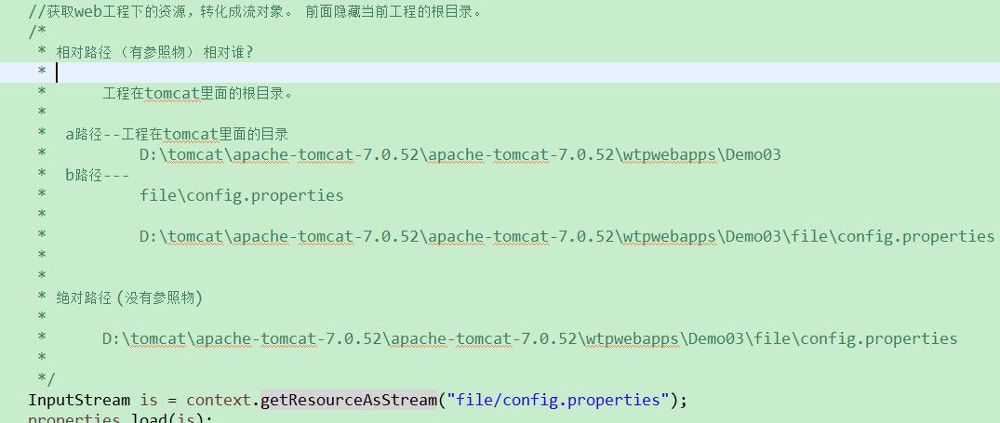

  

# javaEE框架师之路  

  

## 四、JavaWeb基础03   

    
     
### ServletContext   
  
	//1. 获取对象
	ServletContext context = getServletContext();   
   
#### 有什么作用

1. 获取全局配置参数
2. 获取web工程中的资源
3. 存取数据，servlet间共享数据  域对象

#### 可以获取全局配置参数

获取全局参数

   
   

#### 可以获取Web应用中的资源

	1. 获取资源在tomcat里面的绝对路径 : context.getRealPath

			context.getRealPath("") //这里得到的是项目在tomcat里面的根目录。
	
			D:\tomcat\apache-tomcat-7.0.52\apache-tomcat-7.0.52\wtpwebapps\Demo03\
		
		 	String path = context.getRealPath("file/config.properties");
	
			D:\tomcat\apache-tomcat-7.0.52\apache-tomcat-7.0.52\wtpwebapps\Demo03\file\config.properties

	2. getResourceAsStream 获取资源 流对象

		直接给相对的路径，然后获取流对象。

### 通过classloader去获取web工程下的资源

     
     
   
	public class Demo03 extends HttpServlet {
		protected void doGet(HttpServletRequest request, HttpServletResponse response) throws ServletException, IOException {
	
			/*test01();*/
			//test02();
			test03();
			
	
		}
	
		/**
		 * 根据classloader去获取工程下的资源    类加载器（JDBC）
		 */
		private void test03() {
			try {
				// 1. 创建属性对象
				Properties properties = new Properties();
				
				//获取该java文件的class ，然后获取到加载这个class到虚拟机中的那个类加载器对象。
				
				/*
				 * ServletContext
				 * a路径--工程在tomcat里面的目录
				 * 			D:\tomcat\apache-tomcat-7.0.52\apache-tomcat-7.0.52\wtpwebapps\Demo03
				 * 
				 * ClassLoader 
				 * 
				 * a路径： D:\tomcat\apache-tomcat-7.0.52\apache-tomcat-7.0.52\wtpwebapps\Demo03\WEB-INF\classes
				 * 
				 * 默认的lcassloader 的路径是上面这个路径，我们必须得回到Demo03这个目录下，才能进入file目录。如何回到上一级目录呢？
				 *  ../../  ---  D:\tomcat\apache-tomcat-7.0.52\apache-tomcat-7.0.52\wtpwebapps\Demo03
				 * ../../file/config.properties  --- D:\tomcat\apache-tomcat-7.0.52\apache-tomcat-7.0.52\wtpwebapps\Demo03\file\config.properties
	
				 * b路径： D:\tomcat\apache-tomcat-7.0.52\apache-tomcat-7.0.52\wtpwebapps\Demo03\file\config.properties
				 */
	//			System.out.println(getClass().getClassLoader());
				InputStream is = this.getClass().getClassLoader().getResourceAsStream("../../file/config.properties");
				properties.load(is);
				// 3. 获取name属性的值
				String name = properties.getProperty("name");
				System.out.println("name333333=" + name);
				is.close();
			} catch (Exception e) {
				e.printStackTrace();
			}
		}
	
		/**
		 * 根据相对路径，直接获取流对象
		 */
		private void test02() {
			try {
				// 获取ServletContext对象
				ServletContext context = getServletContext();
				
				// 1. 创建属性对象
				Properties properties = new Properties();
				
				//获取web工程下的资源，转化成流对象。  前面隐藏当前工程的根目录。 
				/*
				 * 相对路径 （有参照物） 相对谁?
				 * 
				 * 		工程在tomcat里面的根目录。
				 * 
				 * 	a路径--工程在tomcat里面的目录
				 * 			D:\tomcat\apache-tomcat-7.0.52\apache-tomcat-7.0.52\wtpwebapps\Demo03
				 * 	b路径---			
				 * 			file\config.properties
				 * 
				 * 			D:\tomcat\apache-tomcat-7.0.52\apache-tomcat-7.0.52\wtpwebapps\Demo03\file\config.properties
				 * 	
				 * 
				 * 绝对路径 (没有参照物)
				 * 
				 * 		D:\tomcat\apache-tomcat-7.0.52\apache-tomcat-7.0.52\wtpwebapps\Demo03\file\config.properties
				 * 
				 */
				InputStream is = context.getResourceAsStream("file/config.properties");
				properties.load(is);
				// 3. 获取name属性的值
				String name = properties.getProperty("name");
				System.out.println("name22=" + name);
				is.close();
			} catch (Exception e) {
				e.printStackTrace();
			}
		}
	
		/**
		 * 先获取路径，在获取流对象
		 * @throws FileNotFoundException
		 * @throws IOException
		 */
		private void test01() throws FileNotFoundException, IOException {
			// 获取ServletContext对象
			ServletContext context = getServletContext();
			//获取给定的文件在服务器上面的绝对路径。
			String path = context.getRealPath("file/config.properties");
			System.out.println("path="+path);
			
			// 1. 创建属性对象
			Properties properties = new Properties();
			InputStream is = new FileInputStream(path);
			properties.load(is);
	
			// 3. 获取name属性的值
			String name = properties.getProperty("name");
	
			System.out.println("name=" + name);
		}
	
		protected void doPost(HttpServletRequest request, HttpServletResponse response) throws ServletException, IOException {
			doGet(request, response);
		}
	
	}    
      
#### 使用ServletContext存取数据

1. 定义一个登陆的html页面， 定义一个form表单

2. 定义一个Servlet，名为LoginServlet

3. 针对成功或者失败，进行判断，然后跳转到不一样的网页

    
    
#### HttpServletRequest

> 这个对象封装了客户端提交过来的一切数据。 

1. 可以获取客户端请求头信息

		//得到一个枚举集合  
		Enumeration<String> headerNames = request.getHeaderNames();
		while (headerNames.hasMoreElements()) {
			String name = (String) headerNames.nextElement();
			String value = request.getHeader(name);
			System.out.println(name+"="+value);
			
		}

2. 获取客户端提交过来的数据

		String name = request.getParameter("name");
		String address = request.getParameter("address");
		System.out.println("name="+name);
		System.out.println("address="+address);

		-------------------------------------------------

		//name=zhangsan&name=lisi&name=wangwu 一个key可以对应多个值。

		Map<String, String[]> map = request.getParameterMap();
		
		Set<String> keySet = map.keySet();
		Iterator<String> iterator = keySet.iterator();
		while (iterator.hasNext()) {
			String key = (String) iterator.next();
			System.out.println("key="+key + "--的值总数有："+map.get(key).length);
			String value = map.get(key)[0];
			String value1 = map.get(key)[1];
			String value2 = map.get(key)[2];
			
			System.out.println(key+" ======= "+ value + "=" + value1 + "="+ value2);
		}   
    
3. 获取中文数据

> 客户端提交数据给服务器端，如果数据中带有中文的话，有可能会出现乱码情况，那么可以参照以下方法解决。

* 如果是GET方式
	
	1. 代码转码
			String username = request.getParameter("username");
			String password = request.getParameter("password");
			
			System.out.println("userName="+username+"==password="+password);
			
			//get请求过来的数据，在url地址栏上就已经经过编码了，所以我们取到的就是乱码，
			//tomcat收到了这批数据，getParameter 默认使用ISO-8859-1去解码
			
			//先让文字回到ISO-8859-1对应的字节数组 ， 然后再按utf-8组拼字符串
			username = new String(username.getBytes("ISO-8859-1") , "UTF-8");
			System.out.println("userName="+username+"==password="+password);
		
			直接在tomcat里面做配置，以后get请求过来的数据永远都是用UTF-8编码。 
	

	2. 可以在tomcat里面做设置处理 conf/server.xml 加上URIEncoding="utf-8"
 
		  <Connector connectionTimeout="20000" port="8080" protocol="HTTP/1.1" redirectPort="8443" URIEncoding="UTF-8"/>

* 如果是POST方式

		这个说的是设置请求体里面的文字编码。  get方式，用这行，有用吗？ ---> 没用
		request.setCharacterEncoding("UTF-8");
	
		这行设置一定要写在getParameter之前。   
   
## HttpServletResponse

> 负责返回数据给客户端。 

* 输出数据到页面上

		//以字符流的方式写数据	
		//response.getWriter().write("<h1>hello response...</h1>");
		
		//以字节流的方式写数据 
		response.getOutputStream().write("hello response2222...".getBytes());    

### 响应的数据中有中文，那么有可能出现中文乱码

* 以字符流输出

> response.getWriter()

		//1. 指定输出到客户端的时候，这些文字使用UTF-8编码
		response.setCharacterEncoding("UTF-8");
		
		//2. 直接规定浏览器看这份数据的时候，使用什么编码来看。
		response.setHeader("Content-Type", "text/html; charset=UTF-8");
		
		response.getWriter().write("我爱黑马训练营...");

* 以字节流输出 

> response.getOutputStream()

		//1. 指定浏览器看这份数据使用的码表
		response.setHeader("Content-Type", "text/html;charset=UTF-8");
		
		//2. 指定输出的中文用的码表
		response.getOutputStream().write("我爱深圳黑马训练营..".getBytes("UTF-8"));

### 不管是字节流还是字符流，直接使用一行代码就可以了。

	response.setContentType("text/html;charset=UTF-8");

	然后在写数据即可。