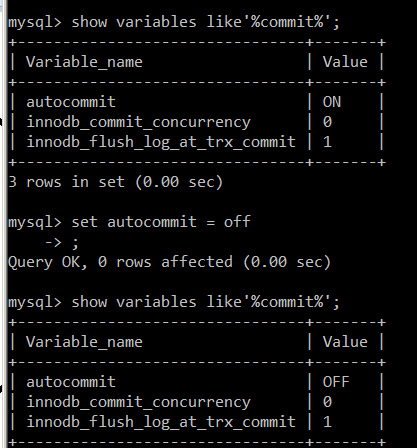
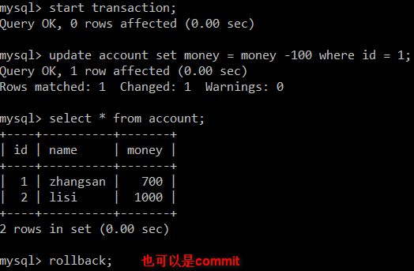
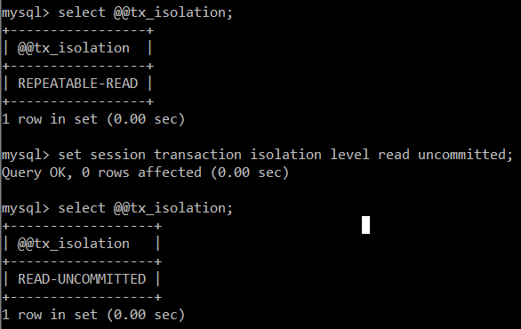
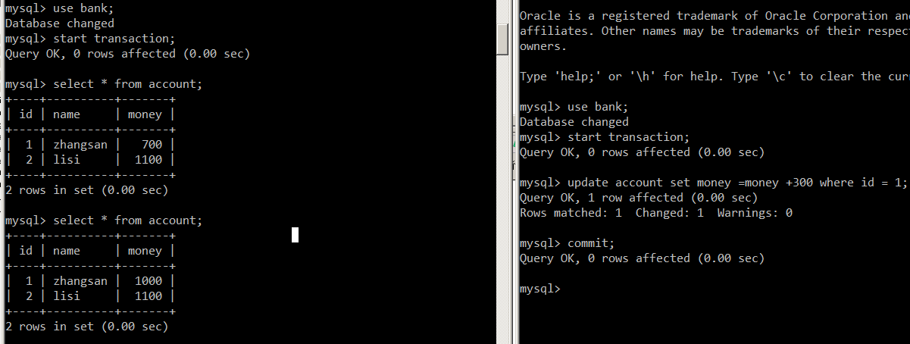
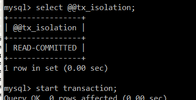

# 事务&数据库连接池&DBUtils

## 回顾

JSP

	三个指令
	
		page  ： 定义当前页面的一些信息 
		include ： 包含其他页面
		taglib : 引入标签库
		
	三个动作标签
	
		<jsp:forward page=""> : 跳转
		<jsp:include page=""> : 包含
		<jsp:param name="" value=""> : 跳转到具体页面或者是某个页面被包含的时候，可以指定这个参数。
		
	九个内置对象
		4+5
		pageContext
			作用范围： 当前页
		request
			作用范围： 一次请求
		session
			作用范围： 一次会话
		application
			作用范围： 整个项目，直到关闭服务器。
		
		
		
		response
		out
		exception
		config -- ServletConfig
		page --- this 这个jsp翻译成java文件的类对象。

EL
	${}
	
		1. 取值。 
		
		<% User user = new User(); 
			pageContext.setAttribute("u" , user);
		%>
		
		${u.name} ---> 是从四个作用域里面，由小到大去获取值。 如果没有， 那就什么都没有。
	
		${sessionScope.u.name} --> 强制到session里面去找
	
		2. 11个隐式对象。 (10 map + 1 pageContext )
		--- 4 (作用域)+ 7  ${}
		
		pageContext
		
		pageScope
		requestScope
		sessionScope
		applicationScop
		
		头相关
		header
		headerValues
		
		参数相关
		param
		paramValues
		
		
		
		cookie
		initparam

JSTL

	1. 导包
	
	2. 引入标签库(1.1 EL)
	
		taglib 
	3. 常用标签
	
		<c:set var="" value="" scope=""> ：存储一个值到作用域里面， page
		<c:if>  ： 判断
		<c:forEach items="" var=""> : 遍历

## 事务

> Transaction  其实指的一组操作，里面包含许多个单一的逻辑。只要有一个逻辑没有执行成功，那么都算失败。 所有的数据都回归到最初的状态(回滚)

* 为什么要有事务?

> 为了确保逻辑的成功。 例子： 银行的转账。 

### 使用命令行方式演示事务。

* 开启事务

	start transaction; 

* 提交或者回滚事务

	commit; 提交事务， 数据将会写到磁盘上的数据库
	rollback ;  数据回滚，回到最初的状态。

1. 关闭自动提交功能。

2. 演示事务

    
      

### 使用代码方式演示事务
> 代码里面的事务，主要是针对连接来的。 
>
>
>	1.  通过conn.setAutoCommit（false ）来关闭自动提交的设置。

>	2. 提交事务  conn.commit();

>	3. 回滚事务 conn.rollback();

	@Test
	public void testTransaction(){
		
		Connection conn = null;
		PreparedStatement ps = null;
		ResultSet rs = null;
		try {
			conn = JDBCUtil.getConn();
			
			//连接，事务默认就是自动提交的。 关闭自动提交。
			conn.setAutoCommit(false);
			
			String sql = "update account set money = money - ? where id = ?";
			ps = conn.prepareStatement(sql);
			
			//扣钱， 扣ID为1 的100块钱
			ps.setInt(1, 100);
			ps.setInt(2, 1);
			ps.executeUpdate();
			
			
			int a = 10 /0 ;
			
			//加钱， 给ID为2 加100块钱
			ps.setInt(1, -100);
			ps.setInt(2, 2);
			ps.executeUpdate();
			
			//成功： 提交事务。
			conn.commit();
			
		} catch (SQLException e) {
			try {
				//事变： 回滚事务
				conn.rollback();
			} catch (SQLException e1) {
				e1.printStackTrace();
			}
			e.printStackTrace();
			
		}finally {
			JDBCUtil.release(conn, ps, rs);
		}
	}

### 事务的特性

* 原子性

> 指的是 事务中包含的逻辑，不可分割。 

* 一致性

> 指的是 事务执行前后。数据完整性

* 隔离性

> 指的是 事务在执行期间不应该受到其他事务的影响

* 持久性

> 指的是 事务执行成功，那么数据应该持久保存到磁盘上。   

### 事务的安全隐患 

> 不考虑隔离级别设置，那么会出现以下问题。

### 读
> 脏读 不可重读读  幻读.

	* 脏读

	> 一个事务读到另外一个事务还未提交的数据

	* 不可重复读 

	> 一个事务读到了另外一个事务提交的数据 ，造成了前后两次查询结果不一致。

#### 读未提交 演示

1. 设置A窗口的隔离级别为 读未提交   

	  

2. 两个窗口都分别开启事务   

	   

### 写

> 丢失更新   

#### 读已提交演示 

1. 设置A窗口的隔离级别为 读已提交

	

2. A B 两个窗口都开启事务， 在B窗口执行更新操作。

	

3. 在A窗口执行的查询结果不一致。 一次是在B窗口提交事务之前，一次是在B窗口提交事务之后。

	

> 这个隔离级别能够屏蔽 脏读的现象， 但是引发了另一个问题  ，不可重复读。

### 可串行化

> 如果有一个连接的隔离级别设置为了串行化 ，那么谁先打开了事务， 谁就有了先执行的权利， 谁后打开事务，谁就只能得着，等前面的那个事务，提交或者回滚后，才能执行。  但是这种隔离级别一般比较少用。 容易造成性能上的问题。 效率比较低。

* 按效率划分，从高到低

> 读未提交  > 读已提交  > 可重复读  > 可串行化

* 按拦截程度 ，从高到底

> 可串行化 > 可重复读 > 读已提交 >  读未提交   

## 事务总结

### 需要掌握的

1. 在代码里面会使用事务 

		conn.setAutoCommit(false);

		conn.commit();

		conn.rollback();

2. 事务只是针对连接连接对象，如果再开一个连接对象，那么那是默认的提交。

3. 事务是会自动提交的。 
   

###需要了解的

####安全隐患

	读
		脏读
			一个事务读到了另一个事务未提交的数据
		不可重复读
			一个事务读到了另一个事务已提交的数据，造成前后两次查询结果不一致
		幻读
			一个事务读到了另一个事务insert的数据 ，造成前后查询结果不一致 。

	写

		丢失更新。

####隔离级别

读未提交

> 引发问题： 脏读 

读已提交

> 解决： 脏读 ， 引发： 不可重复读

可重复读

> 解决： 脏读 、 不可重复读 ， 未解决： 幻读

可串行化

> 解决： 脏读、 不可重复读 、 幻读。

mySql 默认的隔离级别是 可重复读

Oracle 默认的隔离级别是  读已提交   
   
###丢失更新

###解决丢失更新

* 悲观锁

> 可以在查询的时候，加入 for update

* 乐观锁

> 要求程序员自己控制。 

  
## 数据库连接池

>1. 数据库的连接对象创建工作，比较消耗性能。 

>2.一开始现在内存中开辟一块空间（集合） ， 一开先往池子里面放置 多个连接对象。  后面需要连接的话，直接从池子里面去。不要去自己创建连接了。  使用完毕， 要记得归还连接。确保连接对象能循环利用。

### 自定义数据库连接池 

* 代码实现

* 出现的问题：

	1. 需要额外记住 addBack方法
 
 	2. 单例。
 
 	3. 无法面向接口编程。 
 
 		UserDao dao = new UserDaoImpl();
 		dao.insert();
 
 
 		DataSource dataSource = new MyDataSource();
 
 		因为接口里面没有定义addBack方法。 
 
 	4. 怎么解决?   以addBack 为切入点。   

### 解决自定义数据库连接池出现的问题。 

> 由于多了一个addBack 方法，所以使用这个连接池的地方，需要额外记住这个方法，并且还不能面向接口编程。

> 我们打算修改接口中的那个close方法。  原来的Connection对象的close方法，是真的关闭连接。 
> 打算修改这个close方法，以后在调用close， 并不是真的关闭，而是归还连接对象。

### 如何扩展某一个方法?

> 原有的方法逻辑，不是我们想要的。 想修改自己的逻辑

1. 直接改源码  无法实现。

2. 继承， 必须得知道这个接口的具体实现是谁。 

3. 使用装饰者模式。 
   
## 开源连接池

#### DBCP

1. 导入jar文件

2. 不使用配置文件：

		public void testDBCP01(){
		
			
			Connection conn = null;
			PreparedStatement ps = null;
			try {
				
				//1. 构建数据源对象
				BasicDataSource dataSource = new BasicDataSource();
				//连的是什么类型的数据库， 访问的是哪个数据库 ， 用户名， 密码。。
				//jdbc:mysql://localhost/bank 主协议：子协议 ://本地/数据库
				dataSource.setDriverClassName("com.mysql.jdbc.Driver");
				dataSource.setUrl("jdbc:mysql://localhost/bank");
				dataSource.setUsername("root");
				dataSource.setPassword("root");
				
				
				//2. 得到连接对象
				conn = dataSource.getConnection();
				String sql = "insert into account values(null , ? , ?)";
				ps = conn.prepareStatement(sql);
				ps.setString(1, "admin");
				ps.setInt(2, 1000);
				
				ps.executeUpdate();
				
			} catch (SQLException e) {
				e.printStackTrace();
			}finally {
				JDBCUtil.release(conn, ps);
			}
			
		}

2. 使用配置文件方式：

		Connection conn = null;
		PreparedStatement ps = null;
		try {
			BasicDataSourceFactory factory = new BasicDataSourceFactory();
			Properties properties = new Properties();
			InputStream is = new FileInputStream("src//dbcpconfig.properties");
			properties.load(is);
			DataSource dataSource = factory.createDataSource(properties);
			
			//2. 得到连接对象
			conn = dataSource.getConnection();
			String sql = "insert into account values(null , ? , ?)";
			ps = conn.prepareStatement(sql);
			ps.setString(1, "liangchaowei");
			ps.setInt(2, 100);
			
			ps.executeUpdate();
			
		} catch (Exception e) {
			e.printStackTrace();
		}finally {
			JDBCUtil.release(conn, ps);
		}

		

* C3P0

> 拷贝jar文件 到 lib目录

###不使用配置文件方式

		Connection conn = null;
		PreparedStatement ps = null;
		try {
			//1. 创建datasource
			ComboPooledDataSource dataSource = new ComboPooledDataSource();
			//2. 设置连接数据的信息
			dataSource.setDriverClass("com.mysql.jdbc.Driver");
			
			//忘记了---> 去以前的代码 ---> jdbc的文档
			dataSource.setJdbcUrl("jdbc:mysql://localhost/bank");
			dataSource.setUser("root");
			dataSource.setPassword("root");
			
			//2. 得到连接对象
			conn = dataSource.getConnection();
			String sql = "insert into account values(null , ? , ?)";
			ps = conn.prepareStatement(sql);
			ps.setString(1, "admi234n");
			ps.setInt(2, 103200);
			
			ps.executeUpdate();
			
		} catch (Exception e) {
			e.printStackTrace();
		}finally {
			JDBCUtil.release(conn, ps);
		}

###使用配置文件方式

			//默认会找 xml 中的 default-config 分支。 
			ComboPooledDataSource dataSource = new ComboPooledDataSource();
			//2. 设置连接数据的信息
			dataSource.setDriverClass("com.mysql.jdbc.Driver");
			

			//忘记了---> 去以前的代码 ---> jdbc的文档
			dataSource.setJdbcUrl("jdbc:mysql://localhost/bank");
			dataSource.setUser("root");
			dataSource.setPassword("root");
			
			//2. 得到连接对象
			conn = dataSource.getConnection();
			String sql = "insert into account values(null , ? , ?)";
			ps = conn.prepareStatement(sql);
			ps.setString(1, "admi234n");
			ps.setInt(2, 103200);

##DBUtils

###增删改

				//dbutils 只是帮我们简化了CRUD 的代码， 但是连接的创建以及获取工作。 不在他的考虑范围
		QueryRunner queryRunner = new QueryRunner(new ComboPooledDataSource());
	
		
		//增加
		//queryRunner.update("insert into account values (null , ? , ? )", "aa" ,1000);
		
		//删除
		//queryRunner.update("delete from account where id = ?", 5);
		
		//更新
		//queryRunner.update("update account set money = ? where id = ?", 10000000 , 6);

###查询

1. 直接new接口的匿名实现类

		QueryRunner queryRunner = new QueryRunner(new ComboPooledDataSource());
	

		Account  account =  queryRunner.query("select * from account where id = ?", new ResultSetHandler<Account>(){

			@Override
			public Account handle(ResultSet rs) throws SQLException {
				Account account  =  new Account();
				while(rs.next()){
					String name = rs.getString("name");
					int money = rs.getInt("money");
					
					account.setName(name);
					account.setMoney(money);
				}
				return account;
			}
			 
		 }, 6);
		
		System.out.println(account.toString());

2. 直接使用框架已经写好的实现类。

	* 查询单个对象

		QueryRunner queryRunner = new QueryRunner(new ComboPooledDataSource());
		//查询单个对象
		Account account = queryRunner.query("select * from account where id = ?", 
				new BeanHandler<Account>(Account.class), 8);
	
	
	* 查询多个对象

		QueryRunner queryRunner = new QueryRunner(new ComboPooledDataSource());
		List<Account> list = queryRunner.query("select * from account ",
				new BeanListHandler<Account>(Account.class));

###ResultSetHandler 常用的实现类
以下两个是使用频率最高的

	BeanHandler,  查询到的单个数据封装成一个对象
	BeanListHandler, 查询到的多个数据封装 成一个List<对象>

------------------------------------------

	ArrayHandler,  查询到的单个数据封装成一个数组
	ArrayListHandler,  查询到的多个数据封装成一个集合 ，集合里面的元素是数组。 
	
	
	
	MapHandler,  查询到的单个数据封装成一个map
	MapListHandler,查询到的多个数据封装成一个集合 ，集合里面的元素是map。 

ColumnListHandler
KeyedHandler
ScalarHandler

#总结

##事务

	使用命令行演示
	
	使用代码演示

脏读、

不可重复读、

幻读
丢失更新

	悲观锁
	乐观锁

	4个隔离级别
		读未提交
		读已提交
		可重复读
		可串行化
	

##数据连接池

* DBCP
	
	不使用配置

	使用配置

* C3P0

	不使用配置

	使用配置 （必须掌握）

* 自定义连接池 

	装饰者模式

##DBUtils

> 简化了我们的CRUD ， 里面定义了通用的CRUD方法。 

	queryRunner.update();
	queryRunner.query
