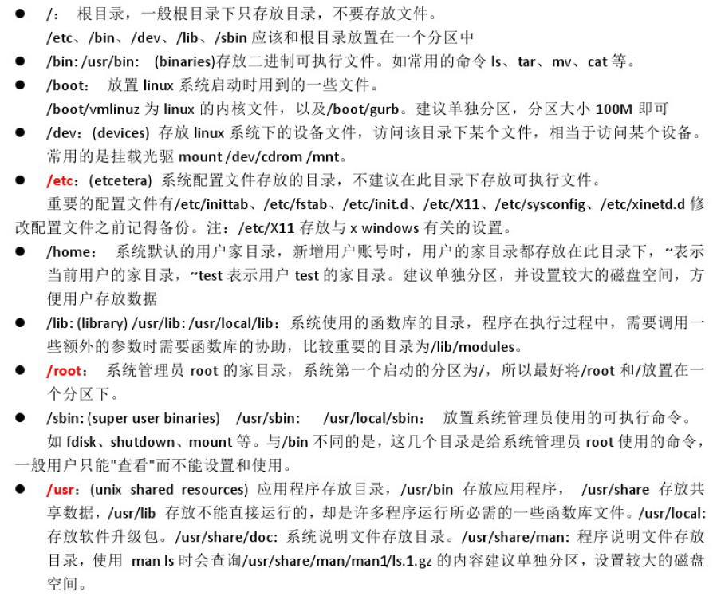
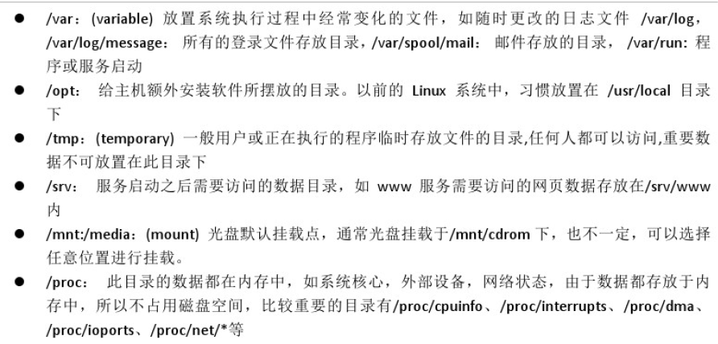
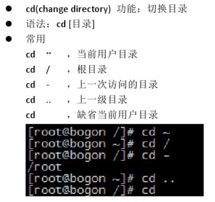
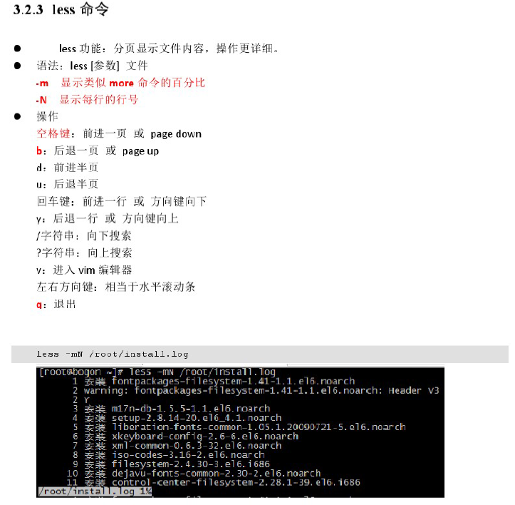

## Linux常用命令
  
	pwd 		打印当前目录
	ll			查看当前目录内容（这个命令可以使用长格式显示文件内容）
	ls			查看当前目录内容（短格式）（ls -l）(-a 所以文件包涵隐藏文件)
	ip addr 	查看当前ip
	touch		创建新空文件夹，(touch 1.txt)
	cd			切换目录（初始登录目录）（cd - 上一次访问目录）（cd.. 上一级目录）
	mkdir		创建目录/文件夹（mkdir a）(mkdir -pv ./abc/123 "父目录不存在先生成父目录")
	cat			显示文本文件内容 （cat install.log）
	more		分页显示文件内容（Enter 默认向下一行,B向上一屏,空格向下一屏,q退出）
	less		更强大的分页显示（方向键，?字符串 "向上搜索" , /字符串 "向下搜索"）（less -mN 文件名字）
	cp			复制文件或目录（cp -r ./abc ./xxx）
	mv			移动或更名现有的文件（mv ./abc/123/ ./xxx/111）(mv ./install.log ./inst.log)
	rm			删除文件或目录（rm -f install.log）(rm -rf ./xxx (强制删除目录))
	find		查找文件或目录（find /root/ -name 'test*'）
	vi或vim		
				输入“vim 文件名” 进入“一般模式”
				按“i” 从“一般模式” 进入 “插入模式”
				按“esc”从“插入模式” 退出到 “一般模式”
				在“一般模式”下，输入“:wq” 退出编辑
				:q! 
				Vi放弃所作修改而直接退到shell下。

	grep		查看特定字符 （如下查看包含 control）
				grep -i control /root/install.log

				cat /root/install.log | grep -i control  
	
	ps -ef		任务管理器（查看进程）（ps -ef | grep -i control）

	tar			备份压缩
					解压： zxvf
					压缩： zcvf		tar -zcvf /root/xxx.tar /root/a/
									tar -zxvf ./xxx.tar
	reboot		重启
	halt		关机
	
	rpm -qa | grep java 查看本机上所有已经安装成功的软件，只查看java
 	
	rpm -qal |grep mysql   查看mysql所有安装包的文件存储位置
		

## 操作系统概念

操作系统作用:管理硬件,服务软件   
   
硬件: 电路,写驱动程序,写应用程序   

操作系统: 微软(windows) /Linux,Unix/苹果(mac)   

Linux操作系统(世界巨头计算机,各个行业软件服务器系统)   

系统开发人员,运维人员,程序开发人员   
   
   
    
### Linux目录结构介绍  

* Linux目录结构: 只有1个目录,根目录
* usr:相当于program files
* etc:存放系统配置文件
* root:系统管理员默认目录
* home:存放其他用户的目录

pwd: 打印当前目录    
cd / : 切换到根目录   
ll : 查看当前目录下的内容   
   
     
   
       

---
   
     
   
     
   
  
