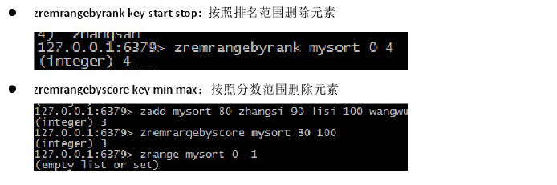

## 安装java，Tomcat，MySQL
  
在Linux命令行输入vim时提示：-bash:vim :common not found
  
	输入 rpm -qa|grep vim 命令,查看返回结果，如果返回的是三条结果：
	
	vim-minimal-7.0.109-6.el5
	vim-common-7.0.109-7.2.el5
	vim-enhanced-7.0.109-7.2.el5
	
	则说明vim已经正确安装，如果缺少一条，则需要单独安装  
  
全部重新安装：

	如果上面的三条都沒有返回, 可以直接用 yum -y install vim* 命令
	yum -y install vim*   
   
配置环境变量：  
  
	1. vim /etc/profile  
	
	2. 在末尾行添加
	#set java environment
	JAVA_HOME=/usr/local/src/java/jdk1.7.0_71
	CLASSPATH=.:$JAVA_HOME/lib.tools.jar
	PATH=$JAVA_HOME/bin:$PATH
	export JAVA_HOME CLASSPATH PATH
	保存退出   
	   
	3. source /etc/profile  使更改的配置立即生效  
	
	4. java -version  查看JDK版本信息，如果显示出1.7.0证明成功   

  
Centos 7 开放查看端口 防火墙关闭打开   

	查看已经开放的端口：
	firewall-cmd --list-ports
	  
	开启端口  
	firewall-cmd --zone=public --add-port=80/tcp --permanent
	  

	命令含义：
	–zone #作用域
	–add-port=80/tcp #添加端口，格式为：端口/通讯协议
	–permanent #永久生效，没有此参数重启后失效   
	    

	重启防火墙   
	firewall-cmd --reload #重启firewall
	systemctl stop firewalld.service #停止firewall
	systemctl disable firewalld.service #禁止firewall开机启动   
    
  
	查询端口号80 是否开启：
	firewall-cmd --query-port=80/tcp
  
	永久开放80端口号：
	firewall-cmd --permanent --zone=public --add-port=80/tcp

	移除80端口号：
	firewall-cmd --permanent --zone=public --remove-port=80/tcp   
   
出现以上安装错误列表的原因是：系统已经安装了其他版本的mysql-libs包和mysql数据库文件导致不兼容。  
  
	yum remove mysql-libs  
  
	监测MySQL是否启动
	systemctl status mysqld.service
	启动MySQL
	systemctl start  mysqld.service
	
	rpm -qa | grep mysql
   
登录MySQL，设置远程访问权限  
  
	grant all privileges on *.* to 'root' @'%' identified by '123456'; 
	flush privileges;  
   
	永久开放3306端口号：
	firewall-cmd --permanent --zone=public --add-port=3306/tcp  
   
---
   
## Redis
   
  
   
	01_ 获取安装包 redis-3.0.7.tar.gz
	02_ 利用filezilla.exe 将安装包上传到/root/
	03_ cd /root/  --->   tar -zxvf redis-3.0.7.tar.gz
	04_ 编译  将源码翻译为.o文件
		cd  /root/redis-3.0.7  ---> make
	05_ 创建一个目录  /usr/loca/redis  (安装目录)
	06_ 安装reids
		cd /root/redis-3.0.7
		make PREFIX=/usr/local/redis install
	07_ 由于redis启动需要一个配置文件,将配置文件复制到 /root/redis/
		cp   /root/redis-3.0.7/redis.conf   /root/redis
	08_ 修改/usr/local/redis/redis.conf
  

	09_ 启动服务端   ./bin/redis-server   ./redis.conf
	10_ 启动客户端   ./bin/redis-cli	
					./bin/redis-cli -h 192.168.10.172 -p 6379  
   

	11_ 测试redis是否正确安装成功
		向服务器发送	ping 命令,服务器返回 pong
		向服务器发送	set name tom
					get name 命令可以看到可以获取到tom的信息 
		向服务器发送keys *   
			可以查看服务器中一共有多少键值对的数据,可以查看到各个键值类型数据  
      
---
   
    
  
   
   
   
Redis默认端口6379，通过当前服务进行查看  
  
	ps -ef | grep -i redis   
  
   
      
   
    
    
     
   
     
    
     
   
    
   
    
   
   
   
   
    
   
   
   
   
   
   
   
   
----
   
## list结构 & Redis特性  
   
   
   
   
   
   
  
   
   
      
   
   
   
   
   
   
  
   
  
   
  
    
   
   
   
   
   
    
   
   
  
   
  
   
  
   
  
   
  
   
  
    
   
    
   
---
   
  
  
   
  
  
  
  
  
   
  

  
---   
     
## Redis特性  
  
  
   
    
   
   
   
  
---  
   
   
   
    
   
    
  
    
  
   
  
   
  
  
  
