
  

# javaEE框架师之路  

  

## 六、Hibernate   

  

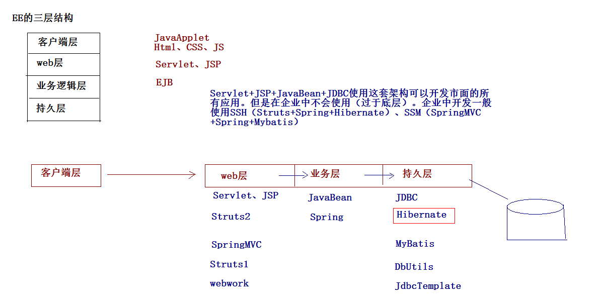   
  
--- 
   
### ORM 概述  
   
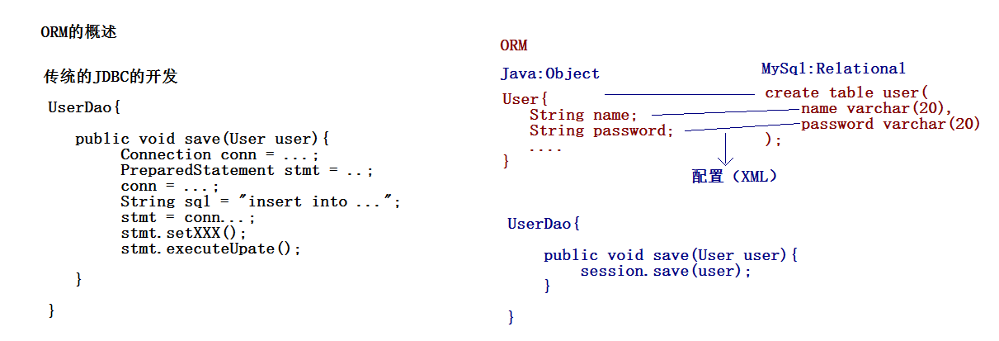   
   
* Hibernate是一个开放源代码的对象关系映射框架，它对JDBC进行了非常轻量级的对象封装，它将POJO与数据库表建立映射关系，是一个全自动的orm框架，hibernate可以自动生成SQL语句，自动执行，使得Java程序员可以随心所欲的使用对象编程思维来操纵数据库。 Hibernate可以应用在任何使用JDBC的场合，既可以在Java的客户端程序使用，也可以在Servlet/JSP的Web应用中使用，最具革命意义的是，Hibernate可以在应用EJB的J2EE架构中取代CMP，完成数据持久化的重任。    
  

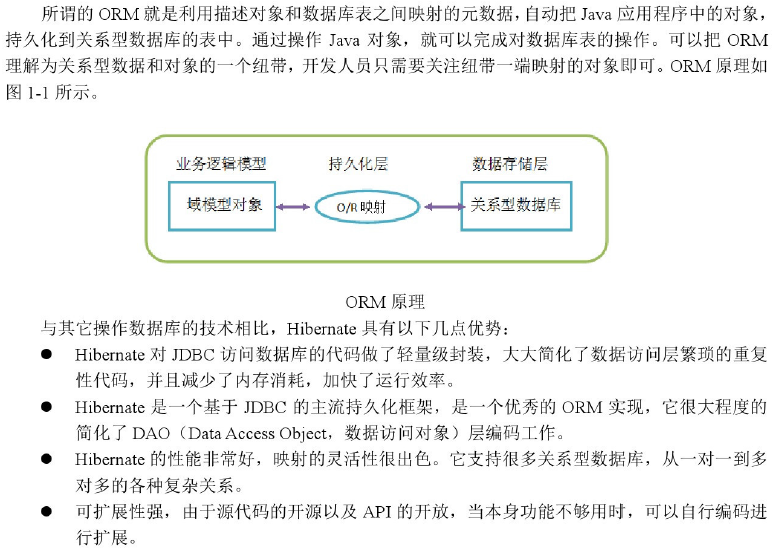    

---
   
### hibernate 结构  
   
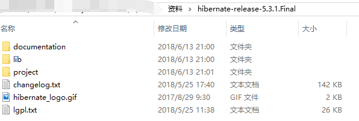    
   
* documentation 	：开发文档
* lib				：开发包
	* required		：开发的必须依赖包
	* optional		：开发的可选jar包
* project			：提供的样例项目  

#### 案例1   
   
	1. 数据库建表  
   
	CREATE TABLE `cst_customer` (
	  `cust_id` bigint(32) NOT NULL AUTO_INCREMENT COMMENT '客户编号(主键)',
	  `cust_name` varchar(32) NOT NULL COMMENT '客户名称(公司名称)',
	  `cust_source` varchar(32) DEFAULT NULL COMMENT '客户信息来源',
	  `cust_industry` varchar(32) DEFAULT NULL COMMENT '客户所属行业',
	  `cust_level` varchar(32) DEFAULT NULL COMMENT '客户级别',
	  `cust_phone` varchar(64) DEFAULT NULL COMMENT '固定电话',
	  `cust_mobile` varchar(16) DEFAULT NULL COMMENT '移动电话',
	  PRIMARY KEY (`cust_id`)
	) ENGINE=InnoDB AUTO_INCREMENT=1 DEFAULT CHARSET=utf8;
   
  
	2. 创建映射 
	// 尽量使用统一命名规范 ： （类名.hbm.xml）
	 
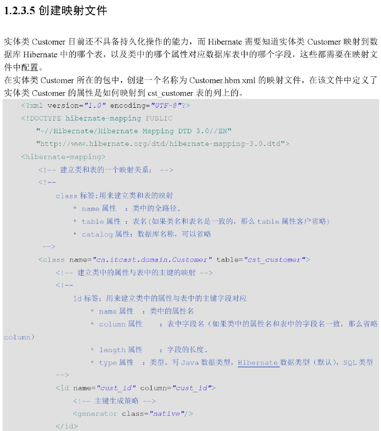    
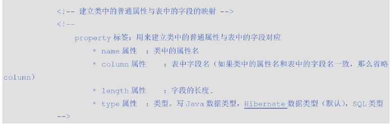    
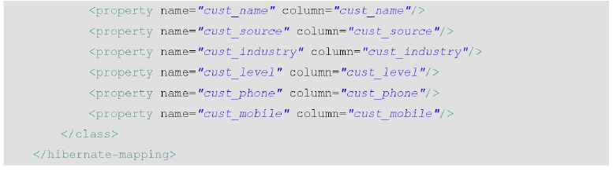    
    
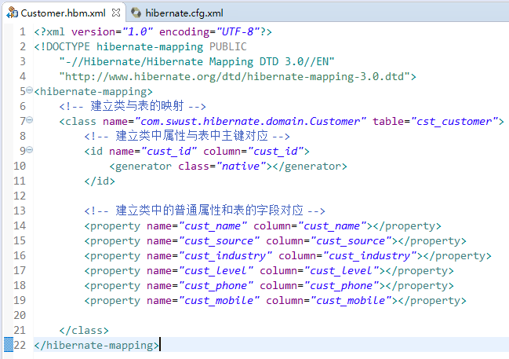    
  
	【class标签配置】
		标签用来建立类与表的映射关系
		属性：
			name		： 类的全路径
			table		： 表名
			catalog		： 数据库
	【id标签】
		标签用来建立类中的属性与表中的主键直接的对应关系
		属性：
			name		：类中属性
			column		：表中字段名（类中的属性名和表中的字段名如果一致，column可以省略）
			length		：长度
			type		：类型
	【property标签】  
		标签用来建立类中的普通属性与表的字段的对应关系
		属性：
			name		：类中属性
			column		：表中字段名
			length		：长度
			type		：类型（可以省略）
			not-null	：设置非空
			unique		：设置唯一
	

#### 创建hibernate的核心配置文件  
  
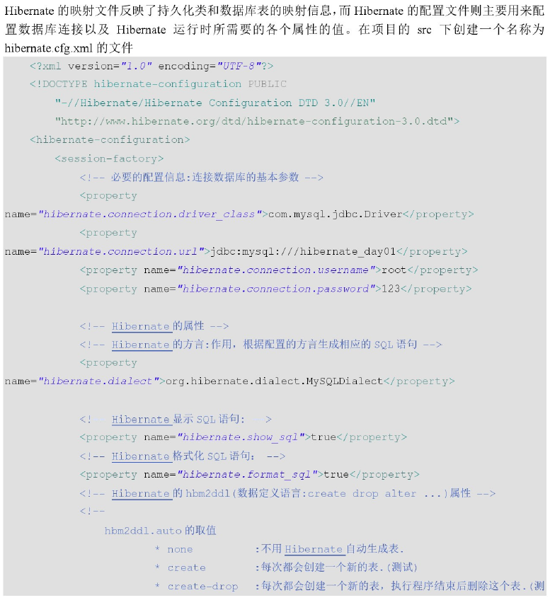    
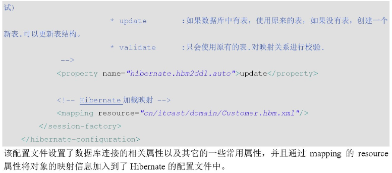    
  
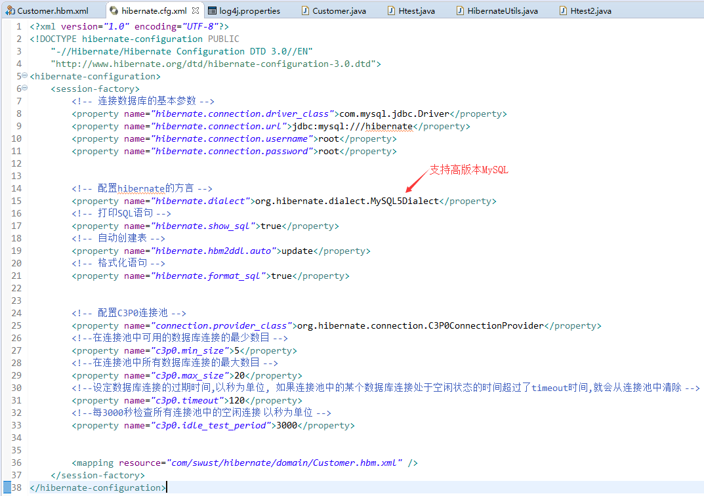    
   
## 基本操作 
  
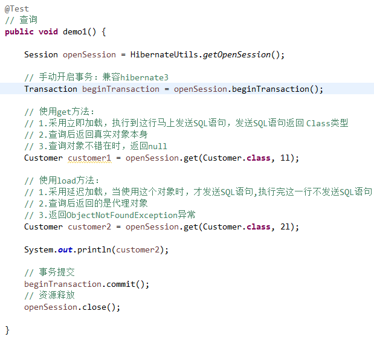    
  
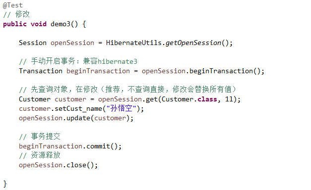   
  
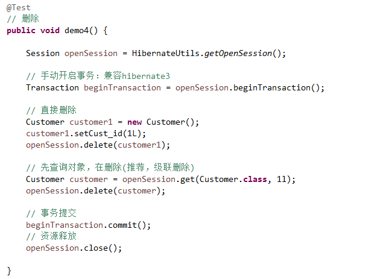   
  
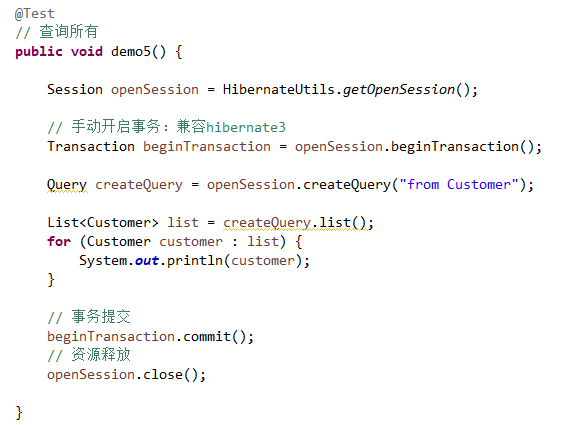   
  

