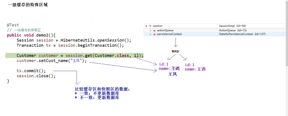
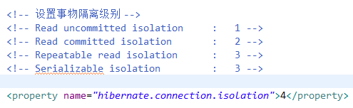
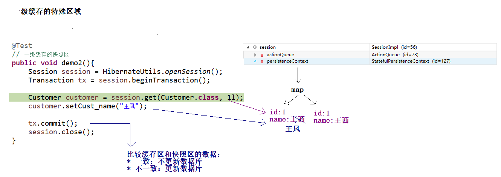
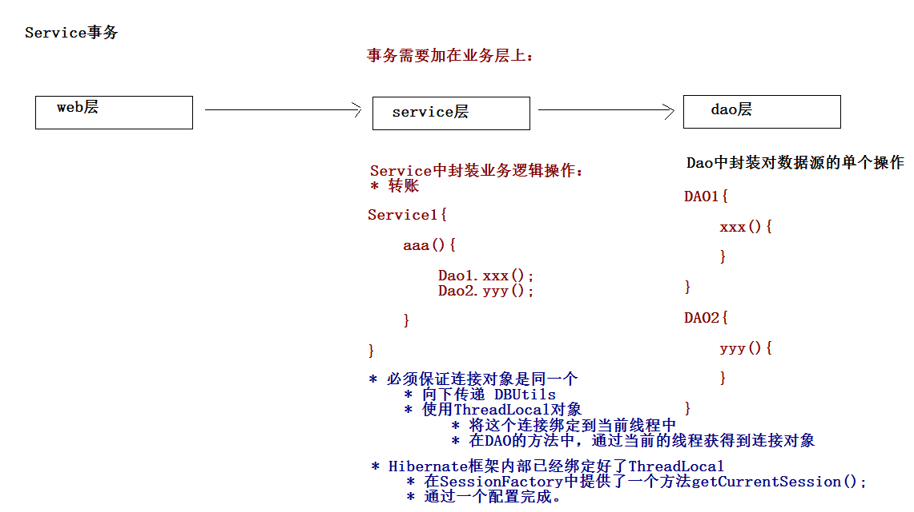
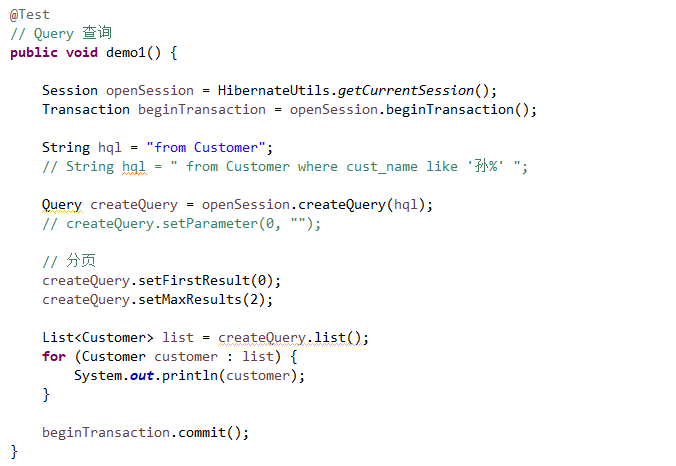
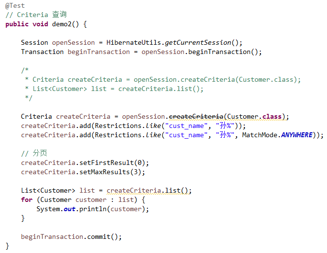

## 持久化类的编写规则   
   
* 对持久化类提供一个无参数的构造方法						： Hibernate底层需要使用反射生成实例。
* 属性需要私有，对私有属性提供public的get和set方法		： Hibernate中获取，设置对象的值。
* 对持久化类提供一个唯一标识OID与数据库主键对应			： Java中通过对象的地址区分是否是同一个对象，数据库中通过主键确定是否是同一个记录，在Hibernate中通过持久化类的OID的属性区分是否是同一个对象。
* 持久化类中属性尽量使用包装类类型						： 因为基本数据类型默认是0.那么0就会有很多的歧义。包装类类型默认值是null。
* 持久化类不要使用final进行修饰						： 延迟加载本身是hibernate一个优化的手段。返回的是一个代理对（javassist可以对没有实现接口的类产生代理----使用了非常底层字节码增强技术，继承这个类进行代理）。如果不能被继承，不能产生代理对象，延迟加载也就失效。load方法和get方法一致。   
   
## 主键的分类  
### 自然主键
* 自然主键：主键的本身就是表中的一个字段（实体中的一个具体的属性）。
* 创建一个人员表，人员都会有一个身份证号（唯一的不可重复的），使用了身份证号作为主键，这种主键称为是自然主键。
  
### 代理主键
* 代理主键：主键的本身不是表中必须的一个字段（不是实体中的某个具体的属性）。
	* 创建一个人员表，没有使用人员中的身份证号，用了一个与这个表不相关的字段ID，（PNO）。这种主键称为是代理主键。
* 在实际开发中，尽量使用代理主键。
	* 一旦自然主键参与到业务逻辑中，后期有可能需要修改源代码。
	* 好的程序设计满足OCP原则：对程序的扩展是open的。对修改源码是close的。    

  
## Hibernate的主键生成策略  

在实际开发中一般不允许用户手动设置主键，一般将主键交给数据库，手动编写程序进行设置。在Hibernate中为了减少程序编写，提供了很多种的主键的生成策略。  

* increment			： hibernate中提供的自动增长机制，适用short、int、long类型的主键。在单线程程序中使用。
	* 首先先发送一条语句：select max(id) from 表;  然后让id+1 作为下一条记录的主键。
* identity			： 适用short、int、long类型的主键，使用的是数据库底层的自动增强机制。适用于有自动增强机制数据库（MySQL、MSSQL）但是Oracle是没有自动增长。
* sequence			： 适用short、int、long类型的主键，采用的是序列的方式。（Oracle支持序列）。像MYSQL就不能使用sequence。
* uuid				： 适用于字符串类型主键。使用hibernate中的随机方式生成字符串主键。
* native			： 本地策略，可以在identity和sequence之间进行自动切换。
* assigned			： hibernate放弃外键的管理，需要通过手动编写程序或者用户自己设置。
* foreign			： 外部的。一对一的一种关联映射的情况下使用。（了解）  
   
  
## 持久化类的三种状态   

Hibernate是持久层框架，通过持久化类完成ORM操作。Hibernate为了更好的管理持久化类，将持久化类分成三种状态。
持久化类 = Java类 + 映射
  
### 瞬时态
这种对象没有唯一的标识OID，没有被session管理，称为是瞬时态对象。
  
### 持久态
这种对象有唯一标识OID，被session管理，称为是持久态对象。  
持久化类的持久态的对象，可以自动更新数据库。
  
### 脱管态
这种对象有唯一标识OID，没有被session管理，称为脱管态对象。   
   

### 瞬时态对象  
  

* 获得
	* Customer customer = new Customer();
* 状态转换
	* 瞬时 ---> 持久
		* save(Object obj)、saveOrUpdate(Object obj);
	* 瞬时 ---> 脱管
		* customer.setCust_id(1l);
  
### 持久态对象  
  
* 获得
	* get()、load()、find()、iterate()
	* Customer customer = session.get(Customer.class,1l);
* 状态转换
	* 持久 ---> 瞬时
		* delete();
	* 持久 ---> 脱管
		* close()、clear()、evict(Object obj);
  
### 脱管态对象
  
* 获得
	* Customer customer = new Customer(); 
	* customer.setCust_id(1l);
* 状态转换
	* 脱管 ---> 持久
		* update(Object obj)、saveOrUpdate(Object obj);
	* 脱管 ---> 瞬时
		* customer.setCust_id(null);   

  
持久化类持久态对象自动更新数据库    
   
## Hibernate的一级缓存   
   
### 什么是缓存  

缓存：是一种优化的方式，将数据存入到内存中，使用的时候直接从缓存中获取，不用通过存储源。   
   
Hibernate框架中提供了优化手段：缓存、抓取策略。Hibernate中提供了二种缓存机制：一级缓存、二级缓存。   
Hibernate的一级缓存：称为是Session级别的缓存，一级缓存生命周期与Session一致（一级缓存是由Session中的一系列的Java集合构成）。一级缓存是**自带的不可卸载的。**（Hibernate的二级缓存是SessionFactory级别的缓存，需要配置的缓存）。    
   
  
     
   
   
### 事务的回顾
什么是事务  

* 事务：事务指的是逻辑上的一组操作，组成这组操作的各个逻辑单元要么全都成功，要么全都失败。  

#### 事务特性  

* 原子性	： 代表事务不可分割。
* 一致性	： 代表事务执行的前后，数据的完整性保持一致。
* 隔离性	： 代表一个事务执行的过程中，不应该受到其他事务的干扰。
* 持久性	： 代表事务执行完成后，数据就持久到数据库中。  

#### 如果不考虑隔离性，引发安全性问题
读问题   

* 脏读		： 一个事务读到另一个事务未提交的数据。
* 不可重复读	： 一个事务读到另一个事务已经提交的update数据，导致在前一个事务多次查询结果不一致。
* 虚读		： 一个事务读到另一个事务已经提交的insert数据，导致在前一个事务多次查询结果不一致。
  
写问题（了解）  

* 引发两类丢失更新
  
#### 读问题的解决

设置事务的隔离级别  

* Read uncommitted		：以上读问题都会发生
* Read committed		：解决脏读，但是不可重复读和虚读有可能发生
* Repeatable read		：解决脏读和不可重复读，但是虚读有可能发生
* Serializable			：解决所有读问题   

   
   
  
图一    
一级缓存中特殊区域：快照区  
   
   
   
图二 
  
    
   
  
## Hibernate的其他的API
   
Query接口用于接收HQL，查询多个对象。    

* HQL：Hibernate Query Language Hibernate查询语言，这种语言与SQL的语法及其类似，面向对象的查询语言。   

    
     
   
## Criteria
Criteria:QBC（Query By Criteria）  

* 更加面向对象的一方查询方式。  
   
      
   
