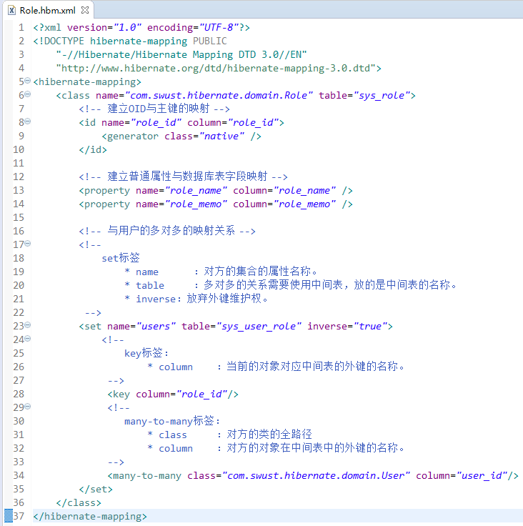

# Hibernate的一对多关联映射
   
## 数据库表与表之间的关系
  
### 一对多的建表原则：   
  
什么样关系属于一对多？  

* 一个部门对应多个员工，一个员工只能属于某一个部门。
* 一个客户对应多个联系人，一个联系人只能属于某一个客户。
  
     
   
     
### 多对多的建表原则：   
  
什么样关系属于多对多？  

* 一个学生可以选择多门课程，一门课程也可以被多个学生选择。
* 一个用户可以选择多个角色，一个角色也可以被多个用户选择。
  
      
   
### 创建映射文件
 
* 多的一方的映射的创建  

    
   
   
* 一的一方的映射的创建  

    
   
  
### 一对多的级联操作  

什么叫做级联  

	级联指的是，操作一个对象的时候，是否会同时操作其关联的对象。
  
级联是有方向性  

	操作一的一方的时候，是否操作到多的一方  
	操作多的一方的时候，是否操作到一的一方  

### 级联保存或更新   
    
**保存客户级联联系人**  

   
   
   
  
**保存联系人级联客户**   
  
   
   
    
  
### 级联删除

删除一边的时候，同时将另一方的数据也一并删除。  
删除客户级联删除联系人   
  
    
   
    
     

删除联系人级联删除客户（基本不用）   
  
    
   
      
    
   
### 一对多设置了双向关联产生多余的SQL语句   
    
       
    
解决多余的SQL语句   

* 单向维护：
* 使一方放弃外键维护权：
	* 一的一方放弃。在set上配置inverse=”true”
* 一对多的关联查询的修改的时候。（CRM练习--）   

   
### 区分cascade和inverse   
   
       
   
## Hibernate多对多关系的配置   
   
* 用户的映射  
  
         
   
* 角色的映射  

       
   
* 多对多测试

      
   
  
### Hibernate的多对多的操作
只保存一边是否可以（不可以）（瞬时对象异常）（使用级联解决）   
   

### Hibernate的多对多级联保存  
   
保存用户级联保存角色   

     
   
保存角色级联保存用户  
  
   
      

### 多对多的级联删除（基本用不上）   
    
删除用户级联删除角色   
   
   
   
删除角色级联删除用户  
   
   
   
### 多对多的其他的操作   

给用户添加角色   
   
   
   
给用户改选角色（删除就只有remove，不添加）   
   
   
   
