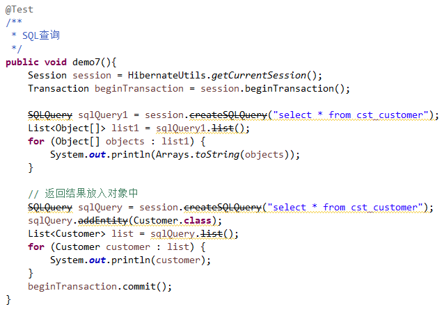

## Hibernate的查询的方式  

>Hibernate共提供了五种查询方式  
   

### Hibernate的查询方式：OID查询   
     
OID检索：Hibernate根据对象的OID（主键）进行检索
     
#### 使用get方法   

	Customer customer = session.get(Customer.class,1l);
   
#### 使用load方法   

	Customer customer = session.load(Customer.class,1l);
   
### Hibernate的查询方式：对象导航检索   
   
对象导航检索：Hibernate根据一个已经查询到的对象，获得其关联的对象的一种查询方式。    

	LinkMan linkMan = session.get(LinkMan.class,1l);
	Customer customer  = linkMan.getCustomer();
	
	Customer customer = session.get(Customer.class,2l);
	Set<LinkMan> linkMans = customer.getLinkMans();
     
### Hibernate的查询方式：HQL检索（重点掌握）   
    
HQL查询：Hibernate Query Language，Hibernate的查询语言，是一种面向对象的方式的查询语言，语法类似SQL。通过session.createQuery()，用于接收一个HQL进行查询方式。   
    
* 初始化一些数据   

     
   
#### HQL的简单查询  
  
     
   
#### HQL的别名查询  

    
   
#### HQL的排序查询   
   
    
   
#### HQL的条件查询   
   
    
    
#### HQL的投影查询   
   
      
   
#### HQL的分页查询   
    
      
   
#### HQL的分组统计查询   
   
    
   
#### HQL的多表查询   
   
##### SQL的多表查询  

* 连接查询
	* 交叉连接：笛卡尔积 `select * from A,B;`  

	* 内连接 : inner join (inner 可以省略)  
		* 隐式内连接： `select * from A,B where A.id = B.aid;`  
		* 显示内连接： `select * from A inner join B on A.id = B.aid;`
	* 外连接	:
		* 左外连接:left outer join(outer 可以省略)  
			`select * from A left outer join B on A.id= B.aid;`
		* 右外连接:right outer join(outer 可以省略)
			`select * from A right outer join B on A.id = B.aid;`
* 子查询

  
HQL的多表查询  

* 连接查询  
	* 交叉连接
	* 内连接
		* 显示内连接
		* 隐式内连接
		* 迫切内连接
	* 外连接
		* 左外连接
		* 右外连接
		* 迫切左外连接   

### Hibernate的查询方式：QBC检索（重点掌握）      
     
>QBC查询：Query By Criteria，条件查询。是一种更加面向对象化的查询的方式。  

#### QBC简单查询
   
   
   
#### QBC排序查询  
   
   
   
#### QBC分页查询   
   
    
   
#### QBC条件查询    
   
    
   
#### QBC统计查询   
   
    
   
#### QBC离线条件查询（SSH）---DetachedCriteria  
   
    
   
### Hibernate的查询方式：SQL检索   
    
          
  
---
   
   
## Hibernate的抓取策略（优化）  
    
### 延迟加载的概述    
   
#### 什么是延迟加载   

延迟加载：lazy（懒加载）。执行到该行代码的时候，不会发送语句去进行查询，在真正使用这个对象的属性的时候才会发送SQL语句进行查询。   
   
#### 延迟加载的分类   
   
类级别的延迟加载     

* 指的是通过load方法查询某个对象的时候，是否采用延迟。session.load(Customer.class,1l);
* 类级别延迟加载通过<class>上的lazy进行配置，如果让lazy失效
	* 将lazy设置为false
	* 将持久化类使用final修饰
	* Hibernate. Initialize()
关联级别的延迟加载   

* 指的是在查询到某个对象的时候，查询其关联的对象的时候，是否采用延迟加载。   

		Customer customer = session.get(Customer.class,1l);
		customer.getLinkMans();
		通过客户获得联系人的时候，联系人对象是否采用了延迟加载，称为是关联级别的延迟。   

* 抓取策略往往会和关联级别的延迟加载一起使用，优化语句。  
  

### 抓取策略   
   
#### 抓取策略的概述   

通过一个对象抓取到关联对象需要发送SQL语句，SQL语句如何发送，发送成什么样格式通过策略进行配置。  

* 通过<set>或者<many-to-one>上通过fetch属性进行设置
* fetch和这些标签上的lazy如何设置优化发送的SQL语句   

  
#### <set>上的fetch和lazy  

fetch：抓取策略，控制SQL语句格式  

* select		：默认值，发送普通的select语句，查询关联对象  
* join			：发送一条迫切左外连接查询关联对象
* subselect		：发送一条子查询查询其关联对象   

lazy：延迟加载，控制查询关联对象的时候是否采用延迟   

* true			：默认值，查询关联对象的时候，采用延迟加载
* false			：查询关联对象的时候，不采用延迟加载
* extra			：及其懒惰  

在实际开发中，一般都采用默认值。如果有特殊的需求，可能需要配置join。   
    
   
#### <many-to-one>上的fetch和lazy   

fetch	：抓取策略，控制SQL语句格式。   

* select	：默认值，发送普通的select语句，查询关联对象。
* join		：发送一条迫切左外连接。  

lazy	：延迟加载，控制查询关联对象的时候是否采用延迟。  

* proxy	：默认值，proxy具体的取值，取决于另一端的<class>上的lazy的值。
* false		：查询关联对象，不采用延迟。
* no-proxy	：（不会使用）   

在实际开发中，一般都采用默认值。如果有特殊的需求，可能需要配置join。    
   
   
#### 什么是批量抓取   
一批关联对象一起抓取，batch-size   
   
