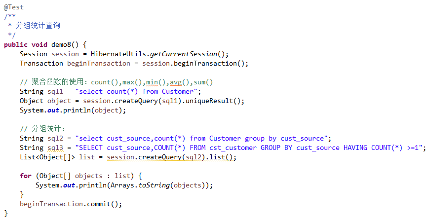

## Hibernate的查询的方式  

>Hibernate共提供了五种查询方式  
   

### Hibernate的查询方式：OID查询   
     
OID检索：Hibernate根据对象的OID（主键）进行检索
     
#### 使用get方法   

	Customer customer = session.get(Customer.class,1l);
   
#### 使用load方法   

	Customer customer = session.load(Customer.class,1l);
   
### Hibernate的查询方式：对象导航检索   
   
对象导航检索：Hibernate根据一个已经查询到的对象，获得其关联的对象的一种查询方式。    

	LinkMan linkMan = session.get(LinkMan.class,1l);
	Customer customer  = linkMan.getCustomer();
	
	Customer customer = session.get(Customer.class,2l);
	Set<LinkMan> linkMans = customer.getLinkMans();
     
### Hibernate的查询方式：HQL检索（重点掌握）   
    
HQL查询：Hibernate Query Language，Hibernate的查询语言，是一种面向对象的方式的查询语言，语法类似SQL。通过session.createQuery()，用于接收一个HQL进行查询方式。   
    
* 初始化一些数据   

     
   
#### HQL的简单查询  
  
     
   
#### HQL的别名查询  

    
   
#### HQL的排序查询   
   
    
   
#### HQL的条件查询   
   
    
    
#### HQL的投影查询   
   
      
   
#### HQL的分页查询   
    
      
   
#### HQL的分组统计查询   
   
    
   
#### HQL的多表查询   
   
##### SQL的多表查询  

* 连接查询
	* 交叉连接：笛卡尔积 `select * from A,B;`  

	* 内连接 : inner join (inner 可以省略)  
		* 隐式内连接： `select * from A,B where A.id = B.aid;`  
		* 显示内连接： `select * from A inner join B on A.id = B.aid;`
	* 外连接	:
		* 左外连接:left outer join(outer 可以省略)  
			`select * from A left outer join B on A.id= B.aid;`
		* 右外连接:right outer join(outer 可以省略)
			`select * from A right outer join B on A.id = B.aid;`
* 子查询

  
HQL的多表查询  

* 连接查询  
	* 交叉连接
	* 内连接
		* 显示内连接
		* 隐式内连接
		* 迫切内连接
	* 外连接
		* 左外连接
		* 右外连接
		* 迫切左外连接   

### Hibernate的查询方式：QBC检索（重点掌握）      
     
>QBC查询：Query By Criteria，条件查询。是一种更加面向对象化的查询的方式。  

#### QBC简单查询
   
   
   
#### QBC排序查询  
   
   
   
#### QBC分页查询   
   
    
   
#### QBC条件查询    
   
    
   
#### QBC统计查询   
   
    
   
#### QBC离线条件查询（SSH）---DetachedCriteria  
   
    
   
### Hibernate的查询方式：SQL检索   
    
    
   
