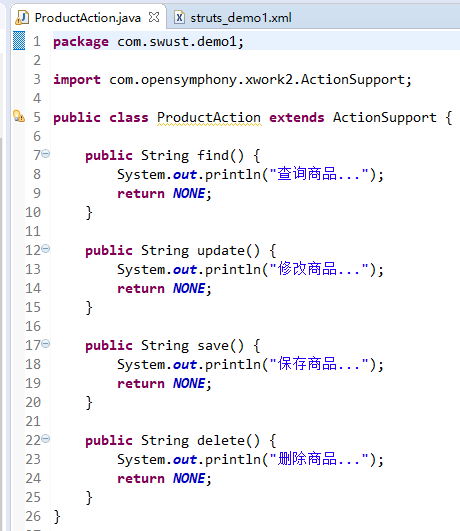
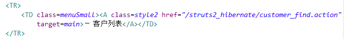

  

# javaEE框架师之路  

  

## Struts2框架   

    
  
>Struts2是一个基于MVC设计模式的Web应用框架，它本质上相当于一个servlet，在MVC设计模式中，Struts2作为控制器(Controller)来建立模型与视图的数据交互。Struts 2是Struts的下一代产品，是在 struts 1和WebWork的技术基础上进行了合并的全新的Struts 2框架。其全新的Struts 2的体系结构与Struts 1的体系结构差别巨大。Struts 2以WebWork为核心，采用拦截器的机制来处理用户的请求，这样的设计也使得业务逻辑控制器能够与ServletAPI完全脱离开，所以Struts 2可以理解为WebWork的更新产品。虽然从Struts 1到Struts 2有着太大的变化，但是相对于WebWork，Struts 2的变化很小。
  
Struts2是一个基于MVC设计模式的WEB层框架。  

* Struts2的内核相对于Struts1来讲已经发生巨大变化。
   
### Web层框架基于前端控制器模型设计   
   

   
   
  
## Struts2的入门  
  
### 解压Struts2开发包   
   
   
   
* apps		： Struts2提供的应用，war文件：web项目打成war包。直接放入到tomcat可以允许。
* docs		： Struts2的开发文档和API
* lib		： Strtus2框架的开发的jar包
* src		： Struts2的源码  

### 创建web项目，引入jar包   
  
   
   
  
### 对Action进行配置
  
在src下创建（提供）名称叫做struts.xml的配置文件   
   
   
   
  
### 配置前端控制器（核心过滤器）   
   
   
    
### 改写Action中的方法的返回值   
   
    
   
### 改写struts.xml   
   
    
      

   
## Struts2的执行流程
  
### 分析Struts2的执行流程    
   
    
  
当用户访问某一个Action的时候，先经过核心过滤器，在核心过滤器中执行一组拦截器（这组拦截器实现部分功能），执行目标Action，根据Action的返回值，进行页面跳转。   
    
   
## Struts2的常见配置   
  
### 加载顺序
* default.properties
* struts-default.xml
* struts-plugin.xml
* **struts.xml**
* **struts.properties**
* **web.xml**   

注意：**后配置的常量的值会覆盖先配置的常量的值。**   
    
   
## Action的配置
### package相关配置  

package标签称为包，这个包与Java中的包的概念不一致。包为了更好管理action的配置。  
  
package标签的属性  

* name		：包的名称，只有在一个项目中不重名即可。
* **extends		：继承哪个包，通常值为struts-default。**
* **namespace	：名称空间，与<action>标签中的name属性共同决定访问路径。**
	* 名称空间有三种写法：
		* 带名称的名称空间		：namespace=”/aaa” 
		* 跟名称空间			：namespance=”/”
		* 默认名称空间			：namespace=””
* abstract		：抽象的，用于其他包的继承。
  
### action相关配置
  
action标签配置Action类。   
action标签的属性    

* name			：与namespace共同决定访问路径
* class			：Action类的全路径
* method		：执行Action中的哪个方法的方法名，默认值execute
* converter		：用于设置类型转换器   

   

## Struts2的常量配置   
   
在Struts2的框架中，提供了非常多的常量：（在default.properties）   

* struts.i18n.encoding=UTF-8			----Struts2中所有的post请求的中文乱码不用处理。
* struts.action.extension=action,,		----Struts2请求的默认的扩展名。默认扩展名是.action或者什么都不写。   
  
在Struts2中修改一些常量的值：   

* 修改常量的值，可以有三个位置进行修正
	* struts.xml中进行修改  
    
	* struts.properties中进行修改  

	* web.xml中进行修改  
    
     
    

## 分模块开发的配置   

### include的配置  
   
      
   
## Action的访问  

### Action的写法  

#### 1.Action类是POJO的类   
    
       
  
      
  
   
  
   
  

#### 2.Action类实现一个Action的接口    
       
   
   
#### 3.Action类继承ActionSupport类   
    
      
   
   
## Action的访问  

### 1.通过method设置      
  
### 2.通过通配符的方式进行配置 （经常使用）     
   
      
  
      
  
      
   
   
   
### 3.动态方法访问    
    
* 开启动态方法访问   

   
   
    
   
* 编写访问路径   

      
   
   
### CRM的客户列表显示  
   
#### 创建包结构   
   
      
  
#### 修改请求路径   
   
      
    
#### 编写Action、Service、DAO   
   
      
   
## 代码流程   
   
      
   
      
   
      
   
      
   
    
   
    
   
    
  
