## Struts2的Servlet的API的访问 

>在使用Struts2的框架的过程中，发现Struts2和Servlet的API是解耦合的。在实际开发中，经常使用到Servlet的API，比如进行登录，将用户的信息保存到Session中，有的时候需要向页面输出一些内容，用到response对象。涉及到Servlet的API的访问。   

### 1.完全解耦合的方式   
   
编写JSP  
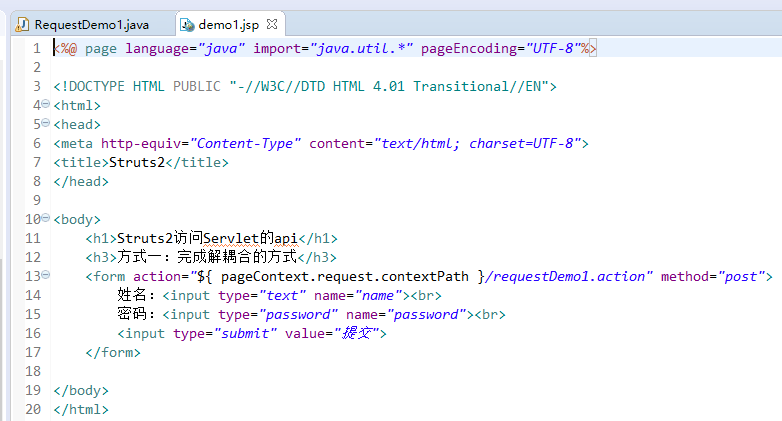    

编写Action    

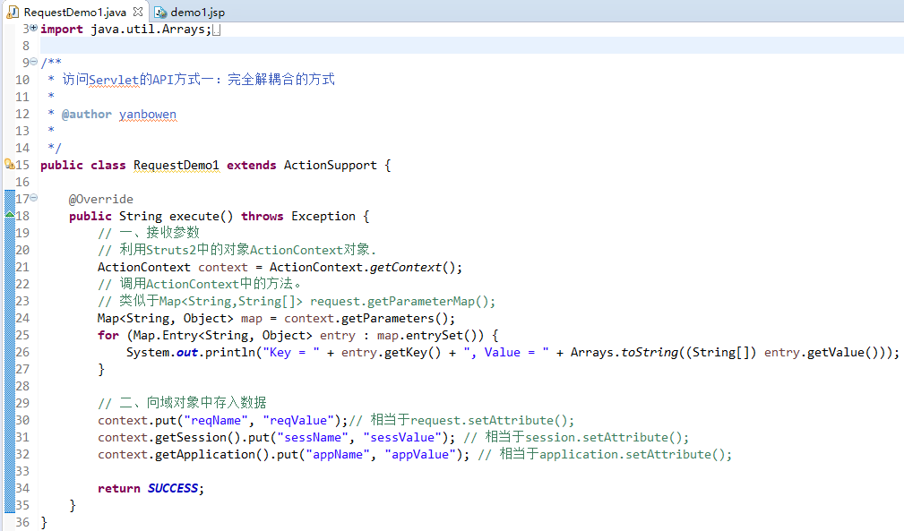    
  
>**注意：这种方式只能获得代表request、session、application的数据的Map集合，不能操作这些对象的本身的方法。**  
  

   
### 2.使用Servlet的API的原生方式 (重点)   
   
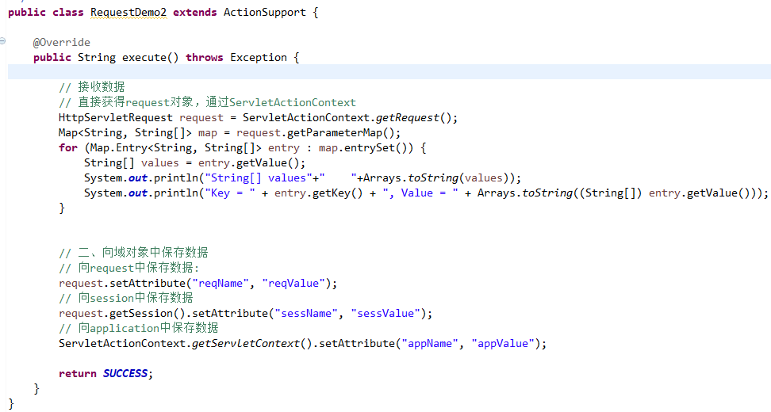    
   
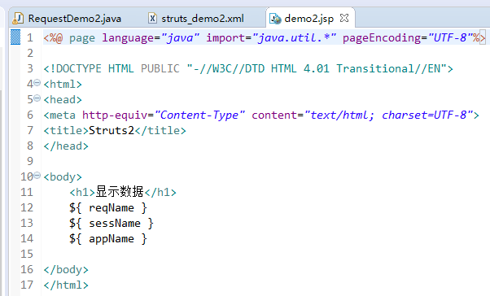       
  
>**注意：这种方式可以操作域对象的数据，同时也可以获得对象的方法。**
  
### 3.接口注入的方式   
   
编写Action    
   
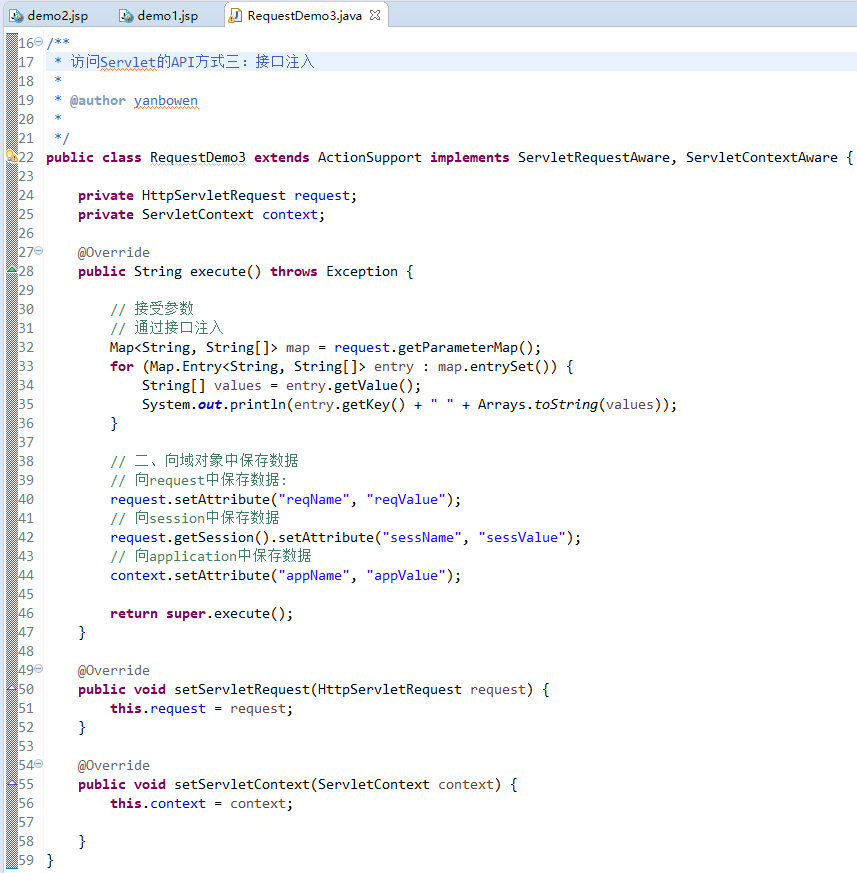    
   
Servlet是单例的，多个程序访问同一个Servlet只会创建一个Servlet的实例。Action是多例的，一次请求，创建一个Action的实例（不会出现线程安全的问题）。
   
## Struts2的结果页面的配置   
    
### 全局结果页面    

>全局结果页面指的是，在包中配置一次，其他的在这个包中的所有的action只要返回了这个值，都可以跳转到这个页面。     
针对这个包下的所有的action的配置都有效。
   
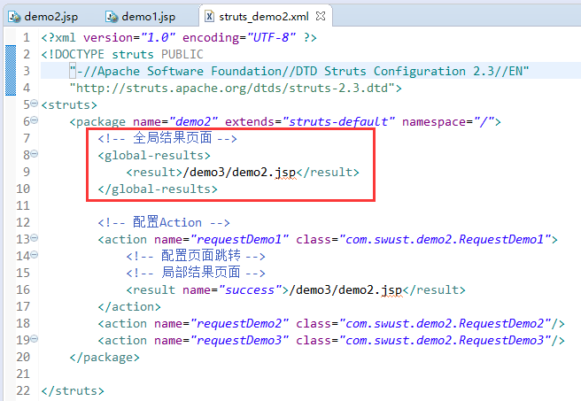     
   
  
### 局部结果页面
      
>局部结果页面：局部结果页面指的是，只能在当前的action中的配置有效。  
针对当前的action有效。
   
   
### result标签的配置     
   
result标签用于配置页面的跳转。在result标签上有两个属性：   

* name属性	：逻辑视图的名称。默认值：success
* type属性	：页面跳转的类型。
	* dispatcher		：默认值，请求转发。（Action转发JSP）
	* redirect			：重定向。（Action重定向JSP）
	* chain				：转发。（Action转发Action）
	* redirectAction	：重定向。（Action重定向Action）
	* stream			：Struts2中提供文件下载的功能。   
  

## Struts2的数据的封装   
   
>Struts2框架是一个web层框架，web层框架（框架：软件的办成品，完成一部分功能）。Struts2提供了数据封装的功能。     

模型驱动方式最常用的方式：    

* 缺点：只能同时向一个对象中封装数据。   

使用第二种可以向多个对象中同时封装数据：

   
### 1.属性驱动：提供属性set方法的方式（不常用）
   
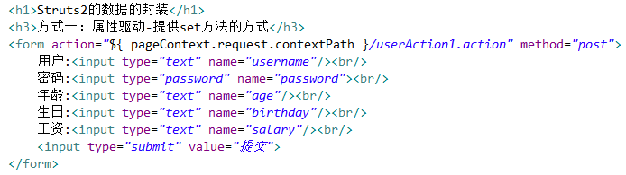    
   
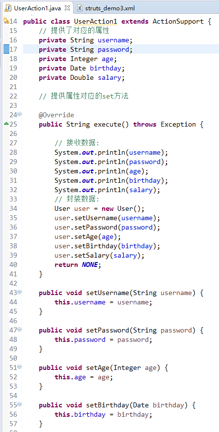    
  
### 2.属性驱动：页面中提供表达式方式   
   
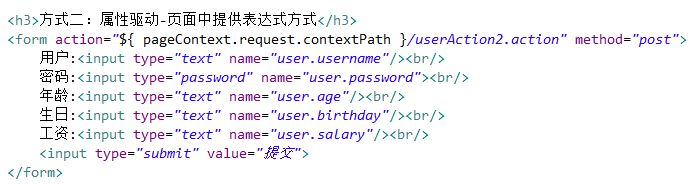        
   
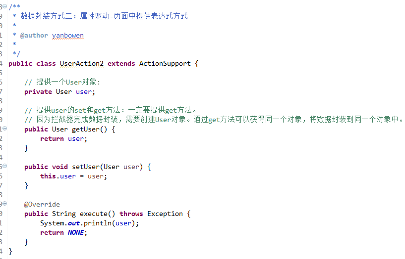    

### 3.模型驱动：采用模型驱动方式（最常用）   
  
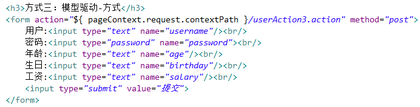   
  
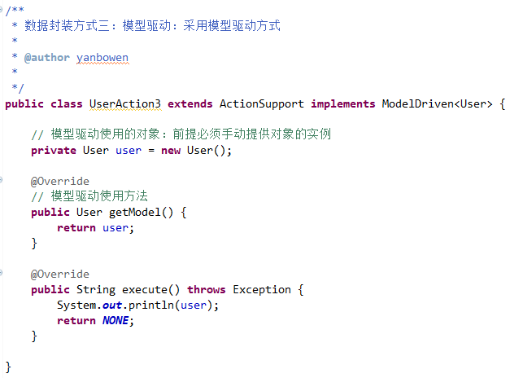   
   
  
## INPUT的逻辑视图的配置   
   
* SUCCESS
* ERROR
* LOGIN
* **INPUT		：input在某些拦截器中会使用。**
* NONE

   
## Struts2的复杂类型的数据封装     
   
### 1.封装数据到List集合中   
     
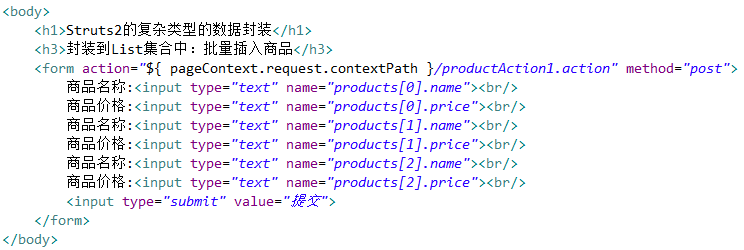     
   
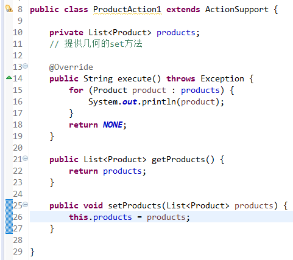      
   
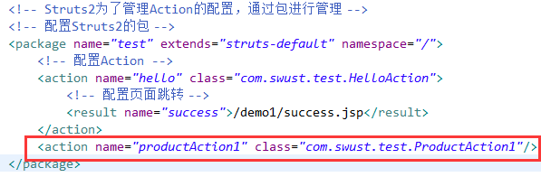     
    
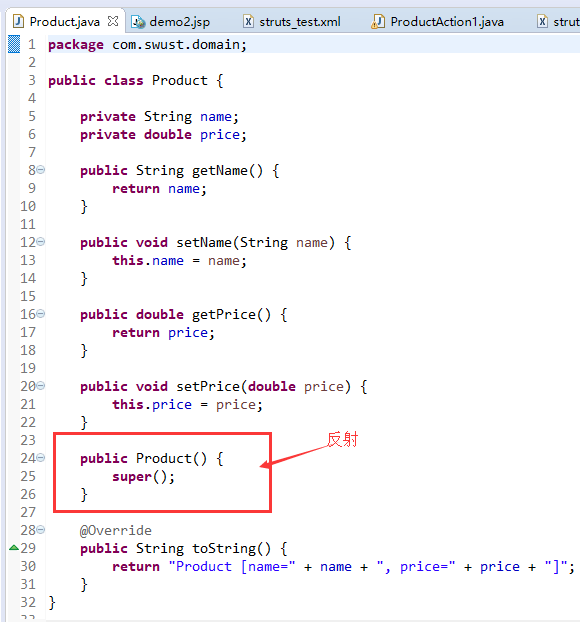   
   
  
### 2.封装数据到Map集合中    
   

   
   
  
