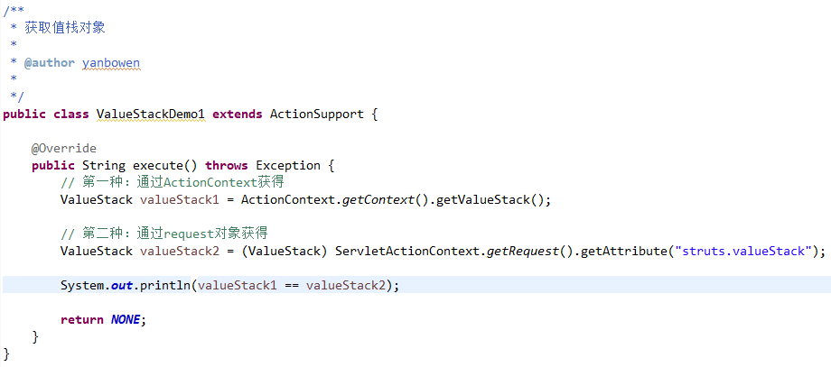
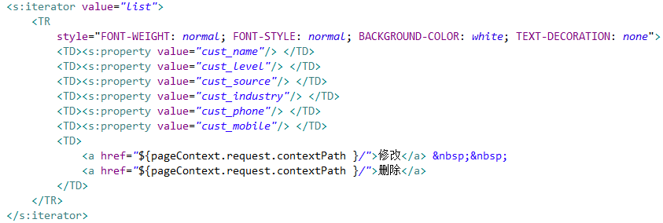

## OGNL   
  
OGNL：对象图导航语言，比EL表达式强大很多倍的语言。  

* EL：从域对象中获取数据，从EL的11个对象中获取。${ name } ${ pageContext.request.contextPath }
* OGNL：调用对象的方法，获取Struts2的值栈的数据。OGNL其实是第三方的表达式语言   

## 值栈     
   
### 什么是值栈

ValueStack其实类似于一个数据中转站（Struts2的框架当中的数据就都保存到了ValueStack中）
 
* ValueStack接口，实现类OgnlValueStack对象。
* ValueStack贯穿整个Action的生命周期。（Action一旦创建了，框架就会创建一个ValueStack对象）。
  
   
### 值栈的内部结构    
   
ValueStack中有两个主要的区域：

* root区域	：其实就是一个ArrayList。里面一般放置对象。获取root的数据不需要加#。
* context区域	：其实就是一个Map。里面放置是web开发的常用的对象数据的引用。获取context数据需要加#。
	* request
	* session
	* application
	* parameters
	* attr  

**所说的操作值栈，通常指的是操作的ValueStack中的root区域。**   
  
    
    
### 值栈与ActionContext的关系   
   
ServletContext：Servlet的上下文。  
ActionContext：Action的上下文。  

* 通过源码查看到：当请求过来的时候，执行过滤器中doFilter方法，在这个方法中创建ActionContext，在创建ActionContext过程中，创建ValueStack对象，将ValueStack对象传递给ActionContext对象。所以可以通过ActionContext获取值栈对象。
* ActionContext对象之所以能够访问Servlet的API（访问是域对象的数据）。因为在其内部有值栈的引用。  

   
### 获得值栈    
   
1.通过ActionContext对象获取值栈。      
   
2.在Struts2的内部，将值栈存入request中一份。    
   
   
   
  
### 操作值栈—向值栈中存入数据   
   
一种：在Action中提供属性的get方法的方式  

* 默认的情况下，将Action对象压入到值栈。Action的属性呢？（也会在值栈中）。    

   
  
       
   
   
二种：使用ValueStack中本身的方法的方式   
   
     

   
### 获取值栈数据
获取值栈中的数据就是在页面中使用OGNL表达式即可。   

* 获取root的数据	：不需要加#  

   
  
    
    
* 获取context数据   

    
   
  
## 综合案例：优化查询     
   
### 将查询到的数据存入到值栈中
   
    
   
### 在页面中使用OGNL表达式获取   
   
    
  
替换以下：  
  
    
   
OGNL表达式： **（不加var）**  
  
     
   
OGNL表达式： **（加var）**  