## Struts2的拦截器   
   
### 什么是拦截器    

Interceptor：拦截器，起到拦截Action的作用  

* Filter：过滤器，过滤从客户端向服务器发送的请求
* Interceptor：拦截器，拦截是客户端对Action的访问。更细粒度化的拦截。（拦截Action中的具体的方法）   
   
Struts2框架核心的功能都是依赖拦截器实现。    
   

### Struts2的执行流程    
      
   
>**客户端向服务器发送一个Action的请求，执行核心过滤器（doFilter）方法。在这个方法中，调用executeAction()方法，在这个方法内部调用dispatcher.serviceAction();在这个方法内部创建一个Action代理，最终执行的是Action代理中的execute(),在代理中执行的execute方法中调用ActionInvocation的invoke方法。在这个方法内部递归执行一组拦截器（完成部分功能），如果没有下一个拦截器，就会执行目标Action，根据Action的返回的结果进行页面跳转。**

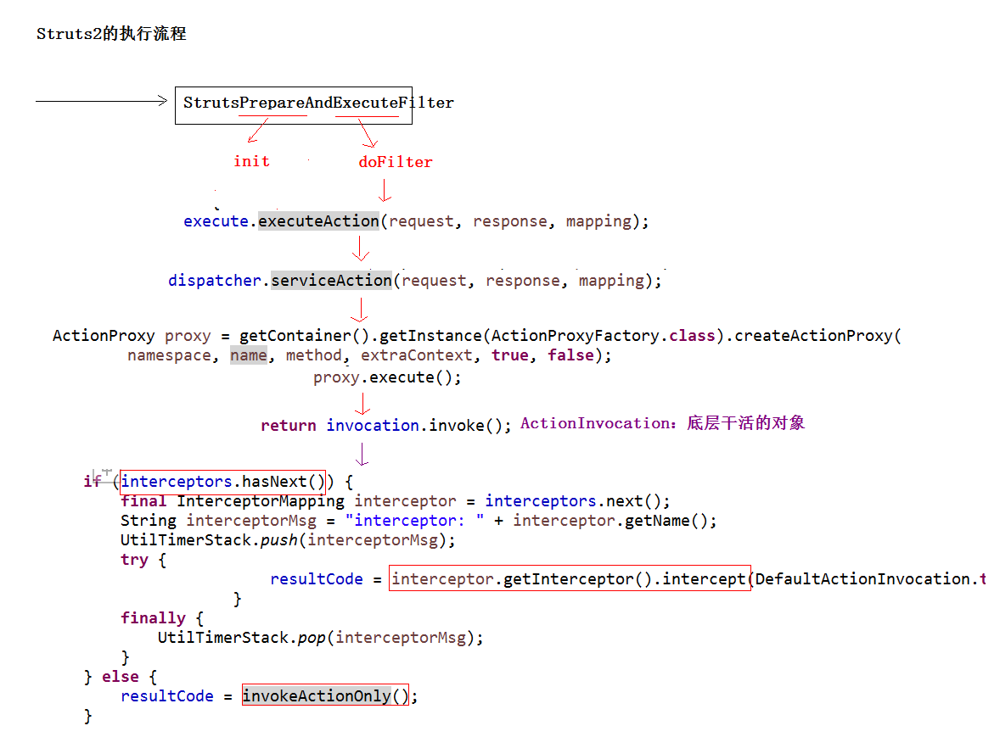   
   
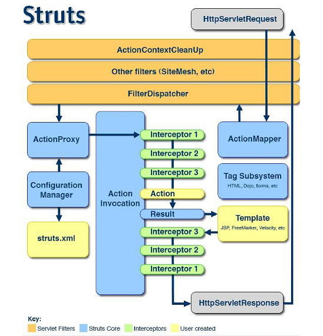   
       
---
  

## 拦截器入门    
   
### 编写拦截器类   
   
编写一个类实现Interceptor接口或者继承AbstractInterceptor类。    
   
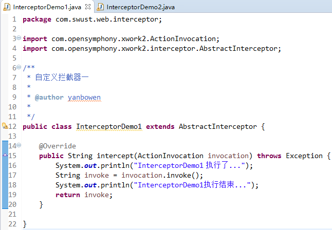   
   
### 对拦截器进行配置   
   
* 定义拦截器进行配置    

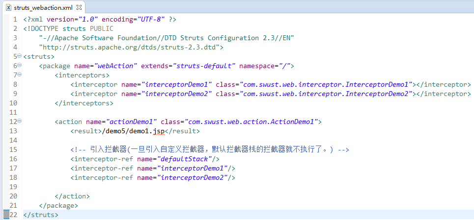      
   
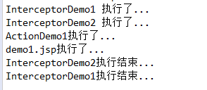   

* 定义一个拦截器栈的方式   

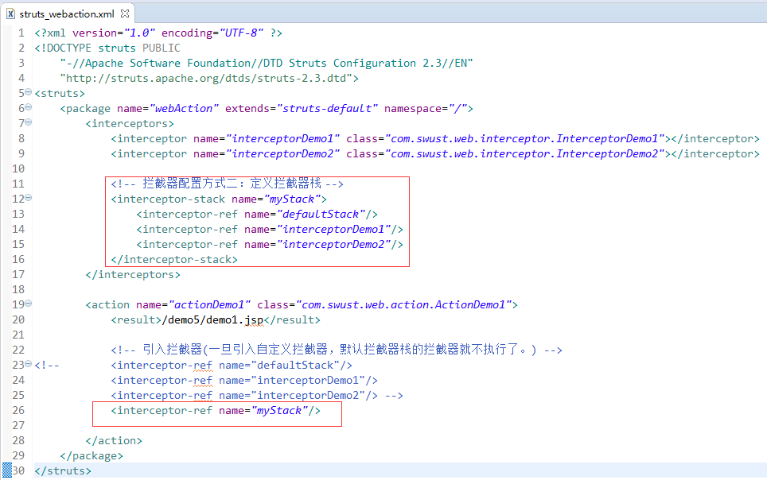      
   
   
## CRM的权限拦截器    
    
>实现用户登录的功能    

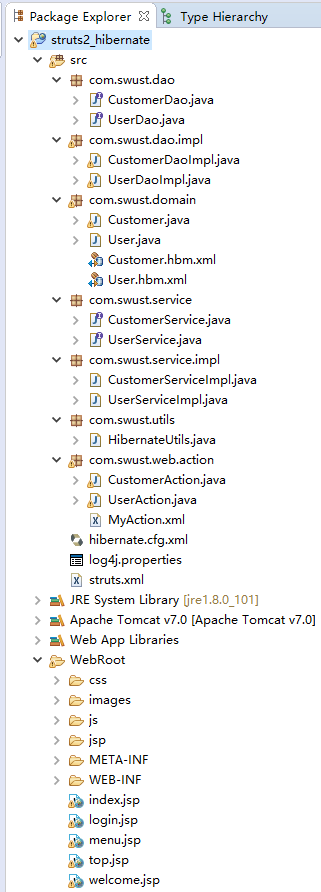  
     
### 创建表和实体    
   
   
	CREATE TABLE `sys_user` (
	  `user_id` bigint(32) NOT NULL AUTO_INCREMENT COMMENT '用户id',
	  `user_code` varchar(32) NOT NULL COMMENT '用户账号',
	  `user_name` varchar(64) NOT NULL COMMENT '用户名称',
	  `user_password` varchar(32) NOT NULL COMMENT '用户密码',
	  `user_state` char(1) NOT NULL COMMENT '1:正常,0:暂停',
	  PRIMARY KEY (`user_id`)
	) ENGINE=InnoDB AUTO_INCREMENT=1 DEFAULT CHARSET=utf8;   
   
   
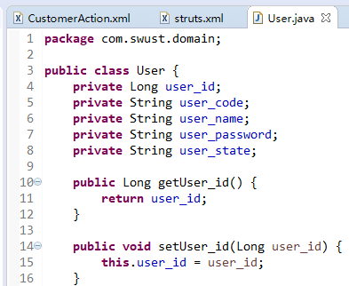   
  

### 提交数据到Action      
      
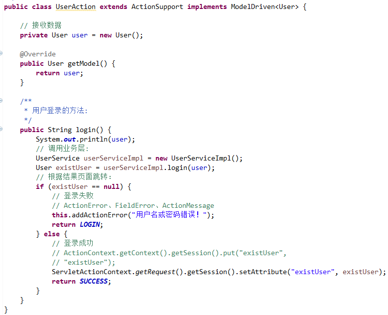     
   
### Action--->Service--->DAO
   
编写Service   
   
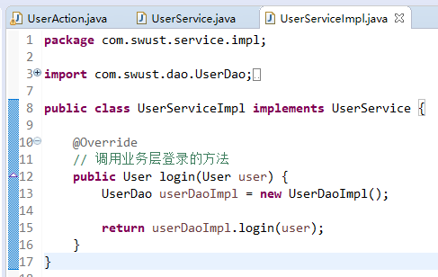       
   
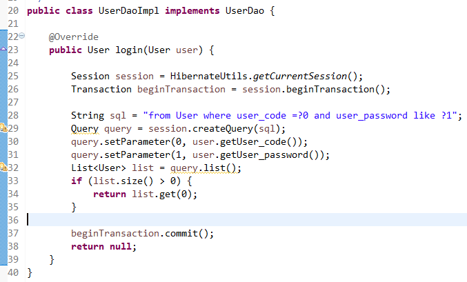       
  
### 根据结果进行页面跳转    
  
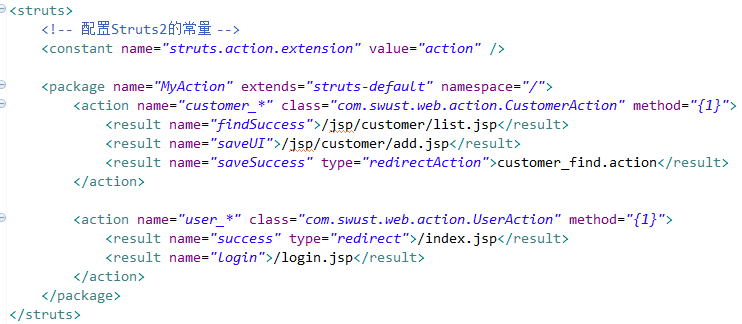           
   
## 实现权限拦截器    
   
### 编写权限拦截器   
   
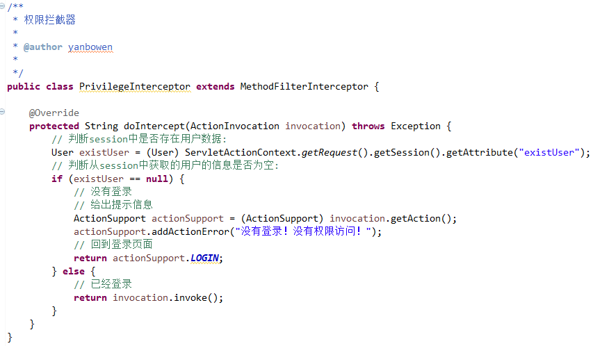   
   
   
### 配置拦截器   
   
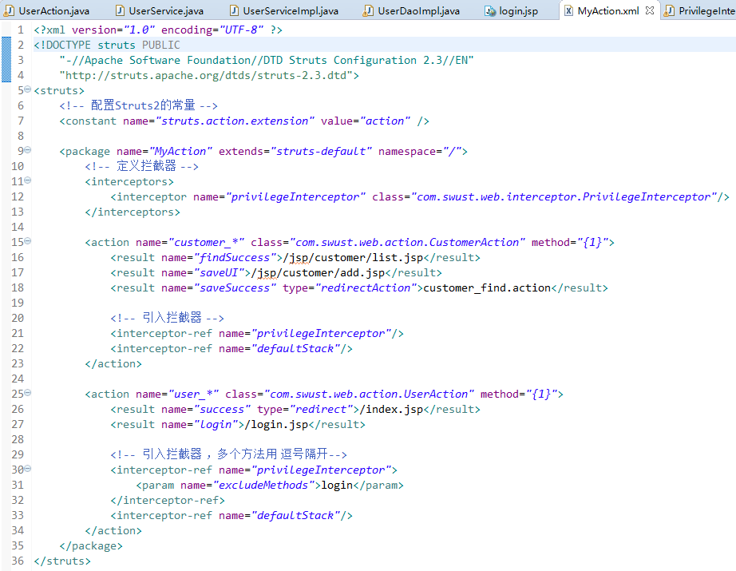   
   
