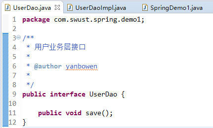

  

# javaEE框架师之路  

  

## Spring框架   

    
    
## Spring概述  
>Spring是一个开放源代码的设计层面框架，他解决的是业务逻辑层和其他各层的松耦合问题，因此它将面向接口的编程思想贯穿整个系统应用。Spring是于2003 年兴起的一个轻量级的Java 开发框架，由Rod Johnson创建。简单来说，Spring是一个分层的JavaSE/EE full-stack(一站式) 轻量级开源框架。
   
Spring：SE/EE开发的**一站式**框架。  

* 一站式框架：有EE开发的每一层解决方案。
	* WEB层		：SpringMVC
	* Service层	：Spring的Bean管理，Spring声明式事务
	* DAO层		：Spring的Jdbc模板，Spring的ORM模块  
    

## Spring的入门（IOC）  
   
### 什么IOC   
  
IOC: Inversion of Control(控制反转)   

* 控制反转：将对象的创建权反转给（交给）Spring。
   
   
  
* docs		：Spring的开发规范和API
* libs		：Spring的开发的jar和源码
* schema		：Spring的配置文件的约束  

    
   
    
     
### 创建接口和类    
       
        
     
   

    
     

### 将实现类交给Spring管理    
    
      
   
### 编写测试类    
   
    
   
### IOC和DI（重点）  
   
IOC：控制反转，将对象的创建权反转给了Spring   

* DI：依赖注入，前提必须有IOC的环境，Spring管理这个类的时候将类的依赖的属性注入（设置）进来   
   
面向对象的时候   
  
依赖  

	//称之B依赖了A
	Class A{
	}
	
	Class B{
		public void xxx(A a){
		}
	}    
   
继承： is a    

	Class A{
	}
	Class B extends A{
	}   
   
聚合/组合关系： has a    
   
* 两个对象之间是整体和部分的关系;比如:我 has a 头;再比如电脑是由显示器、CPU、硬盘这些类聚合成电脑类,而不是从电脑类继承。  

   
## Spring的工厂类    
   
### 1. Spring工厂类的结构图    
  
    
   
   
   
**ApplicationContext继承BeanFactory**
   

### 2. BeanFactory ： 老版本的工厂类   
    
BeanFactory：调用getBean的时候，才会生成类的实例
   
### 3. ApplicationContext ： 新版本的工厂类 （重点）     
    
ApplicationContext：加载配置文件的时候，就会将Spring管理的类都实例化。    
ApplicationContext有两个实现类   

* ClassPathXmlApplicationContext	：加载类路径下的配置文件
* FileSystemXmlApplicationContext	：加载文件系统下的配置文件   

   
## Spring的配置   
   
### Bean的相关的配置    
   
#### <bean>标签的id和name的配置
id		： 使用了约束中的唯一约束。里面不能出现特殊字符的。   
name	： 没有使用约束中的唯一约束（理论上可以出现重复的，但是实际开发不能出现的）。里面可以出现特殊字符。  

* Spring和Struts1框架整合的时候
* <bean name="/user" class=""/>    

   
### Bean的生命周期的配置（了解）    

init-method		:Bean被初始化的时候执行的方法    
destroy-method	:Bean被销毁的时候执行的方法（Bean是单例创建，工厂关闭）    
   
### Bean的作用范围的配置（重点）   
   
scope			： Bean的作用范围    

* **singleton		： 默认的，Spring会采用单例模式创建这个对象。**
* **prototype		： 多例模式。（Struts2和Spring整合一定会用到）**
* request		： 应用在web项目中，Spring创建这个类以后，将这个类存入到request范围中。
* session		： 应用在web项目中，Spring创建这个类以后，将这个类存入到session范围中。
* globalsession	： 应用在web项目中，必须在porlet环境下使用。但是如果没有这种环境，相对于session。   

   
## Spring的属性注入   
    
      
   
### 构造方法的方式的属性注入     
   
     
    
   
### Set方法的方式的属性注入    
   
   
    
   
### Set方法设置对象类型的属性    
     
     
   
   
### P名称空间的属性注入（Spring2.5以后）    
   
通过引入p名称空间完成属性的注入：   
写法：   

* 普通属性	p：属性名=”值”
* 对象属性	p：属性名-ref=”值”    

  
P名称空间的引入    
   
      
   
  
使用p名称空间    
  
   
   
### SpEL的属性注入（Spring3.0以后）    
   
SpEL：Spring Expression Language，Spring的表达式语言。   
语法： #{SpEL}   
   
     
   
  
## Spring的分模块开发的配置    
    
### 在加载配置文件的时候，加载多个   
   
       
      
### 在一个配置文件中引入多个配置文件   

      
   
  
## CRM的综合案例   
   
### 程序问题
每次请求都会创建一个Spring的工厂，这样浪费服务器资源，应该一个项目只有一个Spring的工厂。   

* 在服务器启动的时候，创建一个Spring的工厂。
* 创建完工厂，将这个工厂类保存到ServletContext中。
* 每次使用的时候都从ServletContext中获取。    
  
**使用ServletContextListener**   

* 监听ServletContext对象的创建和销毁。    

### 使用Spring核心监听器ContextLoaderListener（整合web项目）     
   
引入jar包 ： spring-web.jar  
   
#### 配置监听器    
   
     
   
  
