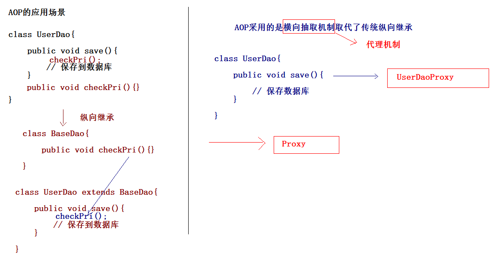

## Spring的IOC的注解开发    
   
### Spring的IOC的注解开发的入门   
   
创建web项目，引入jar包
在Spring4的版本中，除了引入基本的开发包以外，还需要引入aop的包。   
   
  
   
在src下创建applicationContext.xml   

* 引入约束：使用注解开发引入context约束
* spring-framework-5.0.7.RELEASE\docs\spring-framework-reference\index.html   

    
  
开启Spring的组件扫描   
  
   
   
在类上添加注解    
   
   
    
   
编写测试类    
   
    
   
  
### 注解方式设置属性的值
注解方式：使用注解方式，可以没有set方法的。   

* 属性如果有set方法，需要将属性注入的注解添加到set方法。
* 属性如果没有set方法，需要将属性注入的注解添加属性上。   

    
  
  
### Spring的IOC的注解的详解
#### @Component：组件   
   
修饰一个类，将这个类交给Spring管理。  
这个注解有三个衍生注解（功能类似），修饰类。  

* @Controller	： web层
* @Service		： service层
* @Repository	： dao层   

  
### 属性注入的注解    

普通属性：   

* **@Value		：设置普通属性的值。**   
   
对象类型属性：     

* @Autowired	：设置对象类型的属性的值。但是按照**类型**完成属性注入。    
	* 我们习惯是按照名称完成属性注入：必须让@Autowired注解和@Qualifier一起使用完成按照名称属性注入。   
* **@Resource	：完成对象类型的属性的注入，按照名称完成属性注入。**   

       
    
   
   
  
### Bean的其他的注解   

生命周期相关的注解（了解）    

* @PostConstruct	：初始化方法
* @PreDestroy		：销毁方法    

Bean作用范围的注解   

* **@Scope			：作用范围**
	* **singleton	：默认单例**
	* **prototype	：多例**
	* request
	* session
	* globalsession   

  
单例模式  

     
   
多例模式   
   
     
  
     
  
     
     

### IOC的XML和注解开发比较
XML和注解的比较
适用场景    

* XML	：可以适用任何场景。
	* 结构清晰，维护方便。
* 注解：有些地方用不了，这个类不是自己提供的。
	* 开发方便。  

   
### 纯XML形式  
   
  
  
   
  
    
  
    
   
  
## Spring的AOP的XML开发
   
### AOP的概述   
   
AOP:面向切面编程。AOP是OOP的扩展和延伸，解决OOP开发遇到问题。   
   
### Spring底层的AOP实现原理   
  
动态代理   

* JDK动态代理			：只能对实现了接口的类产生代理。
* Cglib动态代理（类似于Javassist第三方代理技术）：对没有实现接口的类产生代理对象。生成子类对象。   

  
      
   
### Spring的AOP底层实现（了解）   
   
#### JDK动态代理   
   
      
   
      
   
      
   
      
     

### Cglib动态代理   
   
Cglib：第三方开源代码生成类库，动态添加类的属性和方法。    
   
     
  
     
   
     
   
  
## Spring的AOP的开发（AspectJ的XML的方式）   
   
### Spring的AOP的简介    
  
AOP思想最早是由AOP联盟组织提出的。Spring使用这种思想最好的框架。   

* Spring的AOP有自己实现的方式（非常繁琐）。AspectJ是一个AOP的框架，Spring引入AspectJ作为自身AOP的开发。
* Spring两套AOP开发方式
	* Spring传统方式（弃用）。
	* Spring基于AspectJ的AOP的开发（使用）。   

  
     
     
### 创建web项目，引入jar包
引入基本开发包   
引入aop开发的相关jar包
   
    
   
### 引入Spring的配置文件    
   
引入aop的约束   
   
    
   
编写目标类并完成配置    
   
    
   
编写测试类：    
  
    
   
编写一个切面类    
   
    
   
将切面类交给Spring   
  
     
   
通过AOP的配置实现    
   
     
       
   
## Spring中通知类型       
   
* 切面（Aspect）：一个关注点的模块化，这个关注点可能会横切多个对象。事务管理是J2EE应用中一个关于横切关注点的很好的例子。在Spring AOP中，切面可以使用基于模式）或者基于@Aspect注解的方式来实现。

* 连接点（Joinpoint）：在程序执行过程中某个特定的点，比如某方法调用的时候或者处理异常的时候。在Spring AOP中，一个连接点总是表示一个方法的执行。

* 通知（Advice）：在切面的某个特定的连接点上执行的动作。其中包括了“around”、“before”和“after”等不同类型的通知（通知的类型将在后面部分进行讨论）。许多AOP框架（包括Spring）都是以拦截器做通知模型，并维护一个以连接点为中心的拦截器链。

* 切入点（Pointcut）：匹配连接点的断言。通知和一个切入点表达式关联，并在满足这个切入点的连接点上运行（例如，当执行某个特定名称的方法时）。切入点表达式如何和连接点匹配是AOP的核心：Spring缺省使用AspectJ切入点语法。

* 引入（Introduction）：用来给一个类型声明额外的方法或属性（也被称为连接类型声明（inter-type declaration））。Spring允许引入新的接口（以及一个对应的实现）到任何被代理的对象。例如，你可以使用引入来使一个bean实现IsModified接口，以便简化缓存机制。

* 目标对象（Target Object）： 被一个或者多个切面所通知的对象。也被称做被通知（advised）对象。 既然Spring AOP是通过运行时代理实现的，这个对象永远是一个被代理（proxied）对象。

* AOP代理（AOP Proxy）：AOP框架创建的对象，用来实现切面契约（例如通知方法执行等等）。在Spring中，AOP代理可以是JDK动态代理或者CGLIB代理。

* 织入（Weaving）：把切面连接到其它的应用程序类型或者对象上，并创建一个被通知的对象。这些可以在编译时（例如使用AspectJ编译器），类加载时和运行时完成。Spring和其他纯Java AOP框架一样，在运行时完成织入。

**通知类型：**

* 前置通知（Before advice）：在某连接点之前执行的通知，但这个通知不能阻止连接点之前的执行流程（除非它抛出一个异常）。

* 后置通知（After returning advice）：在某连接点正常完成后执行的通知：例如，一个方法没有抛出任何异常，正常返回。

* 异常通知（After throwing advice）：在方法抛出异常退出时执行的通知。

* 最终通知（After (finally) advice）：当某连接点退出的时候执行的通知（不论是正常返回还是异常退出）。

* 环绕通知（Around Advice）：包围一个连接点的通知，如方法调用。这是最强大的一种通知类型。环绕通知可以在方法调用前后完成自定义的行为。它也会选择是否继续执行连接点或直接返回它自己的返回值或抛出异常来结束执行。 
    
### 前置通知：在目标方法执行之前进行操作    
  
前置通知：获得切入点信息      
      

   
### 后置通知：在目标方法执行之后进行操作     
   
后置通知：获得方法的返回值。    
       

      
   
   
    
   
### 环绕通知：在目标方法执行之前和之后进行操作    
    
环绕通知可以阻止目标方法的执行    
       
   
      
  
      
   
   
   
### 异常抛出通知：在程序出现异常的时候，进行的操作    
      
    
    
   
   
      
   
   
### 最终通知：无论代码是否有异常，总是会执行     
    
   
### Spring的切入点表达式写法：   
   
语法   

	[访问修饰符] 方法返回值 包名.类名.方法名(参数)
	public void com.swust.spring.CustomerDao.save(..)
	* *.*.*.* Dao.save(..)
	* com.swust.spring.CustomerDao+.save(..)
	* com.swust.spring..*.*(..)