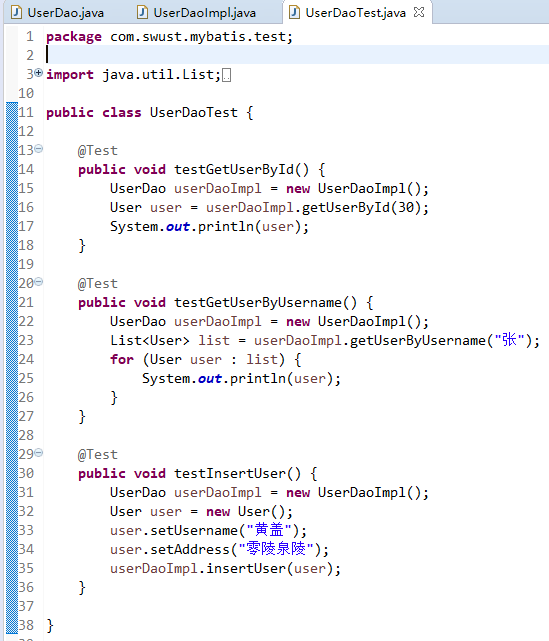
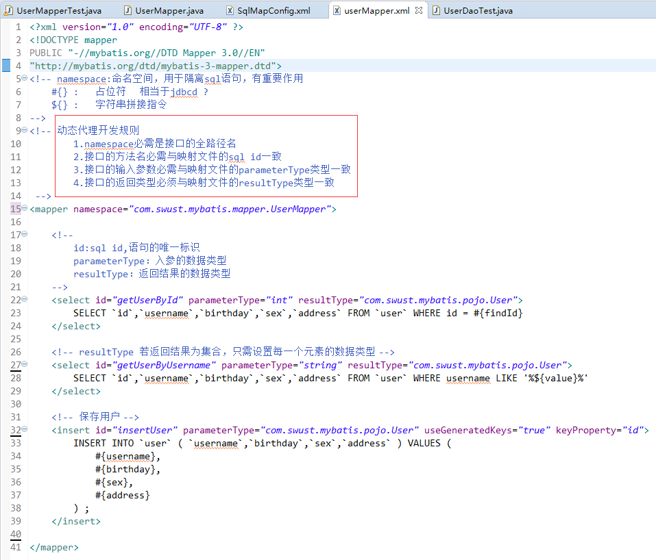

  

# javaEE框架师之路  

  

## mybatis简介   

      
  
## Mybatis  
>Mybatis就是类似于hibernate的orm持久层框架。
    
MyBatis 本是apache的一个开源项目iBatis, 2010年这个项目由apache software foundation 迁移到了google code，并且改名为MyBatis 。2013年11月迁移到Github。   
Mybatis是面向sql的持久层框架，他封装了jdbc访问数据库的过程，我们开发，只需专注于sql语句本身的拼装，其它复杂的过程全部可以交给mybatis去完成。
      
   
### Mybatis项目结构   
   
     

   
### Mybatis配置文件   

    
  

## 根据用户ID查询用户信息   
   
映射文件与sql    
       
    
   
### MyBatis访问数据库代码    
    
	@Test
	public void testGetUserById() throws Exception {
		// 创建SqlSessionFactoryBuilder对象
		SqlSessionFactoryBuilder factoryBuilder = new SqlSessionFactoryBuilder();
		// 创建核心配置文件输入流
		InputStream resourceAsStream = Resources.getResourceAsStream("SqlMapConfig.xml");
		// 通过输入流创建SqlSessionFactory对象
		SqlSessionFactory sqlSessionFactory = factoryBuilder.build(resourceAsStream);
		// 创建SqlSession对象
		SqlSession sqlSession = sqlSessionFactory.openSession();
		User user = sqlSession.selectOne("user.getUserById", 1);

		System.out.println(user);
		// 释放资源
		sqlSession.close();
	}    
   
    
### 抽取SqlSessionFactoryUtils工具类   
   
    
   
## 根据用户名查找用户列表    
映射文件与sql
   
   
   
  
### MyBatis访问数据库代码   
   
   
   
   
## 添加用户   
映射文件与sql    
   
   
   
### MyBatis访问数据库代码    
   
   
   
  
### 级联插入（返回外键）
   
  
   
   
  
## 修改用户 & 删除用户  
   
   
   
   
   
  
### Mybatis架构图
   
   
   
## 原始Dao开发方法   
   
   
   
   
  
   
  
## 官方推荐，接口动态代理  
   
### 动态代理dao开发规则   
   
	1.namespace必需是接口的全路径名
	2.接口的方法名必需与映射文件的sql id一致
	3.接口的输入参数必需与映射文件的parameterType类型一致
	4.接口的返回类型必须与映射文件的resultType类型一致   
   
   
   
   
   
   
   
   
   
### SqlMapConf.xml配置    
   
