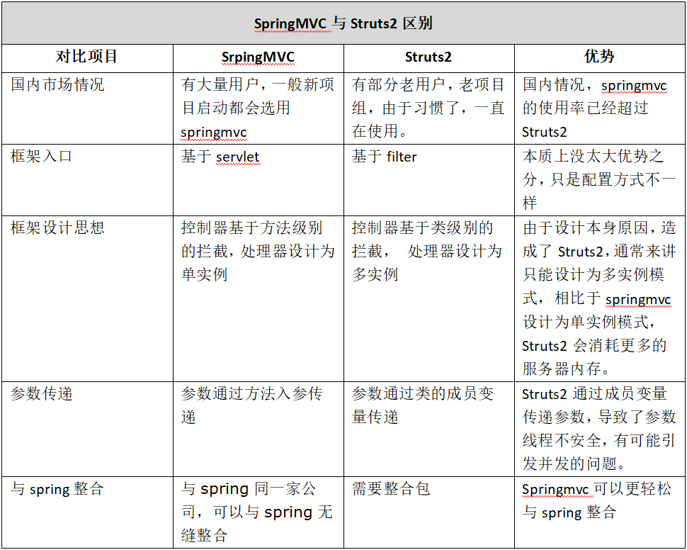
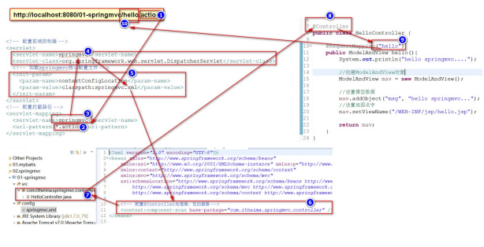
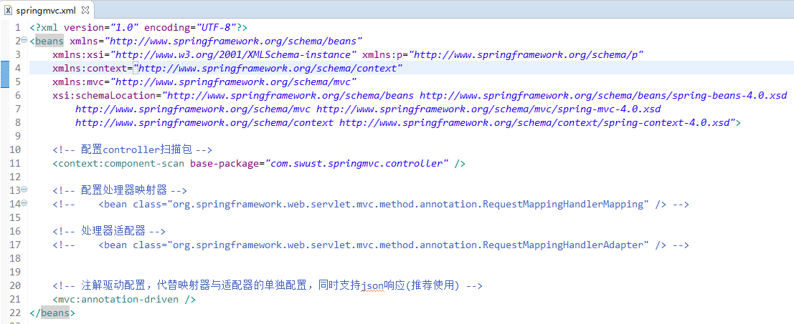
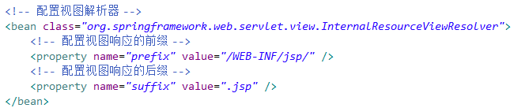
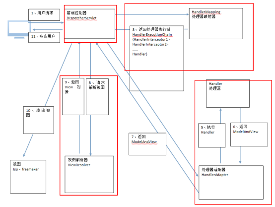

  

# javaEE框架师之路  

  

## SpringMVC简介   

      
  
## SpringMVC和Struts2区别比较  

    
      
### springmvc代码执行流程   

     
  

## 处理器映射器与处理器适配器   
  
### 处理器映射器   
   
从spring3.1版本开始，废除了DefaultAnnotationHandlerMapping的使用，推荐使用RequestMappingHandlerMapping完成注解式处理器映射。   
  
   
### 处理器适配器   
   
从spring3.1版本开始，废除了AnnotationMethodHandlerAdapter的使用，推荐使用RequestMappingHandlerAdapter完成注解式处理器适配。   
   
**映射器与适配器必需配套使用，如果映射器使用了推荐的RequestMappingHandlerMapping，适配器也必需使用推荐的RequestMappingHandlerAdapter。**   
   
   
### 注解驱动   
   
   
 
   
### 视图解析器    
   
   
   
   
### springMVC架构   
  
   